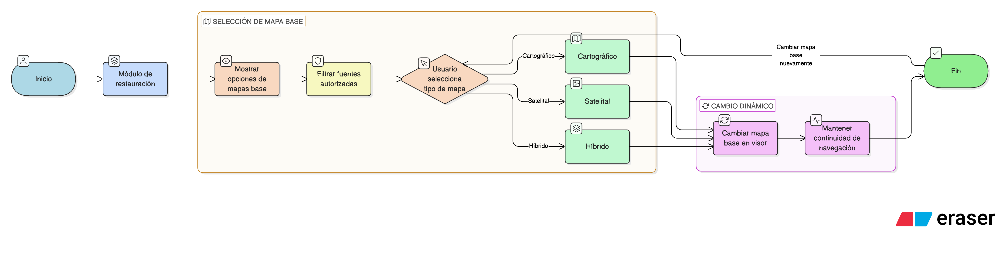

# HU-IDEAM-SNIF-REST-005

> **Identificador Historia de Usuario:** hu-ideam-snif-rest-005\
> **Nombre Historia de Usuario:** Selección de mapa base

> **Sistema de información:** Sistema Nacional de Información Forestal\
> **Módulo / subsistema:** Módulo de restauración\
> **Validador temático(s):** Raymond Alexander Jiménez Arteaga

## DESCRIPCIÓN HISTORIA DE USUARIO

> **Como:** usuario del SNIF.\
> **Quiero:** seleccionar mapas base autorizados (cartográfico, satelital, híbrido).\
> **Para:** visualizar el territorio sin recargar el visor.

## CRITERIOS DE ACEPTACIÓN

1. **Cambio dinámico**  
   1.1 Cambio dinámico del mapa base sin recargar el visor.

2. **Fuentes autorizadas**  
   2.1 Uso exclusivo de fuentes institucionales o autorizadas.

## ROLES

- **Todos los perfiles:** Pueden cambiar mapa base.

## RESTRICCIONES Y LÍMITES

- Solo se permiten mapas base de fuentes institucionales o autorizadas.
- El cambio debe ser dinámico sin afectar la continuidad de la navegación.

## DIAGRAMA DE FLUJO DEL PROCESO

