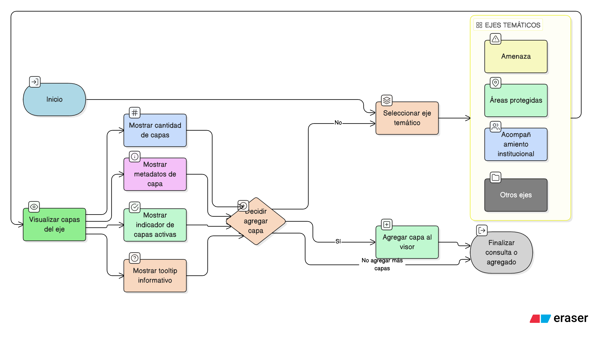

# HU-IDEAM-SNIF-REST-008

> **Identificador Historia de Usuario:** hu-ideam-snif-rest-008\
> **Nombre Historia de Usuario:** Catálogo de capas temáticas

> **Sistema de información:** Sistema Nacional de Información Forestal\
> **Módulo / subsistema:** Módulo de restauración\
> **Validador temático(s):** Raymond Alexander Jiménez Arteaga

## DESCRIPCIÓN HISTORIA DE USUARIO

> **Como:** usuario del SNIF.\
> **Quiero:** consultar y agregar capas temáticas desde el Catálogo.\
> **Para:** visualizar información agrupada por ejes temáticos.

## CRITERIOS DE ACEPTACIÓN

1. **Agrupación temática**  
   1.1 Agrupación por ejes (ej. Amenaza, Áreas protegidas, Acompañamiento institucional).

2. **Información por grupo**  
   2.1 El sistema debe visualizar:  
   - Cantidad de capas por grupo.  
   - Metadatos de la capa (descripción, entidad, tipo de servicio).  
   - Indicador de capas activas.  
   - Tooltip informativo.

## ROLES

- **Todos los perfiles:** Pueden consultar y agregar capas.

## RESTRICCIONES Y LÍMITES

- Las capas se organizan por ejes temáticos predefinidos.
- Los metadatos son informativos y no editables desde el visor.

## DIAGRAMA DE FLUJO DEL PROCESO

