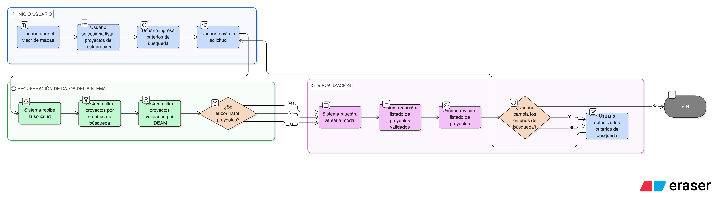

# HU-IDEAM-SNIF-REST-011

> **Identificador Historia de Usuario:** hu-ideam-snif-rest-011\
> **Nombre Historia de Usuario:** Listar proyectos desde el visor

> **Sistema de información:** Sistema Nacional de Información Forestal\
> **Módulo / subsistema:** Módulo de restauración\
> **Validador temático(s):** Raymond Alexander Jiménez Arteaga

## DESCRIPCIÓN HISTORIA DE USUARIO

> **Como:** usuario del SNIF.\
> **Quiero:** listar proyectos de restauración validados por IDEAM en una ventana modal sobre el visor.\
> **Para:** consultar proyectos según criterios de búsqueda definidos.

## CRITERIOS DE ACEPTACIÓN

1. **Visualización modal**  
   1.1 El sistema debe mostrar el listado de proyectos en una ventana modal sobre el visor.

2. **Proyectos validados**  
   2.1 Solo se listan proyectos de restauración validados por IDEAM.

## ROLES

- **Todos los perfiles:** Pueden listar proyectos.

## RESTRICCIONES Y LÍMITES

- Solo se muestran proyectos validados por IDEAM.
- El listado se presenta en ventana modal.

## DIAGRAMA DE FLUJO DEL PROCESO

