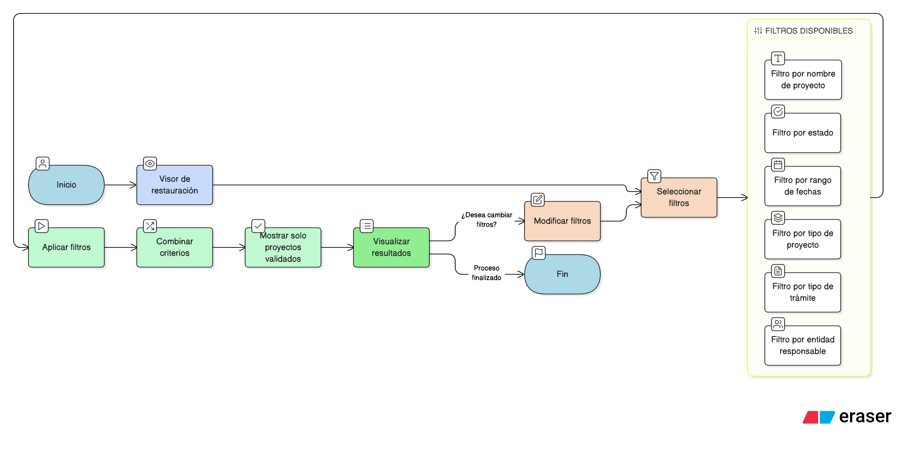

# HU-IDEAM-SNIF-REST-012

> **Identificador Historia de Usuario:** hu-ideam-snif-rest-012\
> **Nombre Historia de Usuario:** Filtrar proyectos desde el visor

> **Sistema de información:** Sistema Nacional de Información Forestal\
> **Módulo / subsistema:** Módulo de restauración\
> **Validador temático(s):** Raymond Alexander Jiménez Arteaga

## DESCRIPCIÓN HISTORIA DE USUARIO

> **Como:** usuario del SNIF.\
> **Quiero:** filtrar proyectos de restauración.\
> **Para:** encontrar proyectos específicos según criterios definidos.

## CRITERIOS DE ACEPTACIÓN

1. **Filtros mínimos**  
   1.1 El sistema debe permitir filtrar por:  
   - Nombre del proyecto.  
   - Estado.  
   - Rango de fechas.  
   - Tipo de proyecto.  
   - Tipo de trámite.  
   - Entidad responsable.

## ROLES

- **Todos los perfiles:** Pueden filtrar proyectos.

## RESTRICCIONES Y LÍMITES

- Los filtros aplican sobre proyectos validados.
- Los filtros son combinables entre sí.

## DIAGRAMA DE FLUJO DEL PROCESO

