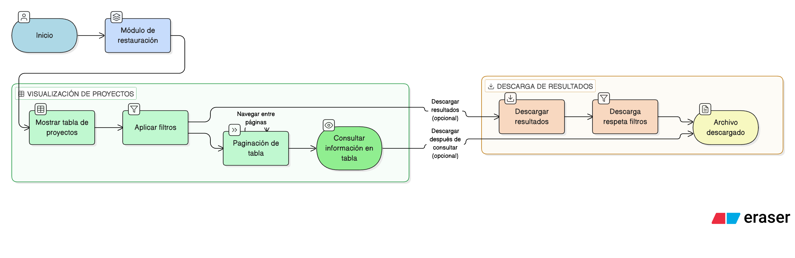

# HU-IDEAM-SNIF-REST-013

> **Identificador Historia de Usuario:** hu-ideam-snif-rest-013\
> **Nombre Historia de Usuario:** Visualizar proyectos en tabla de datos

> **Sistema de información:** Sistema Nacional de Información Forestal\
> **Módulo / subsistema:** Módulo de restauración\
> **Validador temático(s):** Raymond Alexander Jiménez Arteaga

## DESCRIPCIÓN HISTORIA DE USUARIO

> **Como:** usuario del SNIF.\
> **Quiero:** visualizar los resultados de proyectos en una tabla con paginación.\
> **Para:** consultar la información de manera organizada y descargarla.

## CRITERIOS DE ACEPTACIÓN

1. **Presentación en tabla**  
   1.1 El sistema debe mostrar los resultados en una tabla con paginación.

2. **Opción de descarga**  
   2.1 El sistema debe permitir descargar los resultados.

## ROLES

- **Todos los perfiles:** Pueden visualizar y descargar proyectos.

## RESTRICCIONES Y LÍMITES

- La tabla incluye paginación para facilitar la navegación.
- La descarga respeta los filtros aplicados.

## DIAGRAMA DE FLUJO DEL PROCESO

