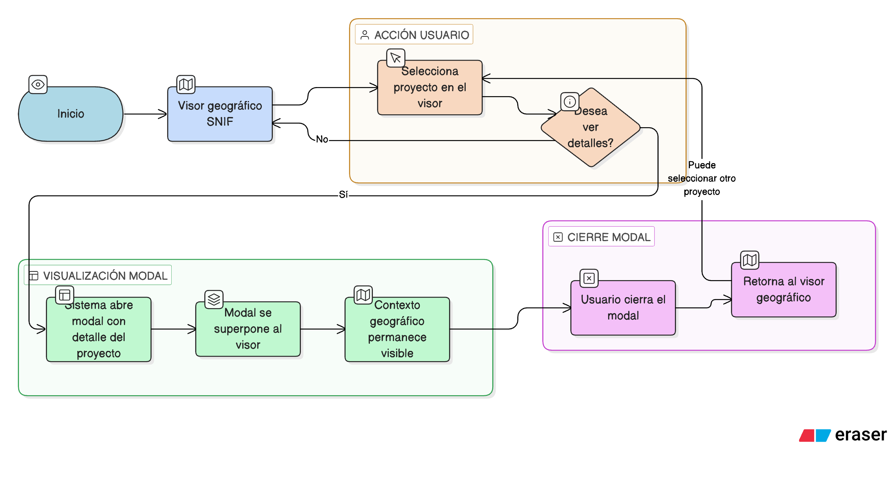

# HU-IDEAM-SNIF-REST-015

> **Identificador Historia de Usuario:** hu-ideam-snif-rest-015\
> **Nombre Historia de Usuario:** Formulario modal del proyecto sobre el visor

> **Sistema de información:** Sistema Nacional de Información Forestal\
> **Módulo / subsistema:** Módulo de restauración\
> **Validador temático(s):** Raymond Alexander Jiménez Arteaga

## DESCRIPCIÓN HISTORIA DE USUARIO

> **Como:** usuario del SNIF.\
> **Quiero:** que el detalle del proyecto se abra en un modal.\
> **Para:** mantener el contexto geográfico del visor.

## CRITERIOS DE ACEPTACIÓN

1. **Visualización modal**  
   1.1 El sistema debe abrir el detalle del proyecto en un modal sobre el visor.

2. **Contexto geográfico**  
   2.1 El contexto geográfico del visor debe mantenerse visible.

## ROLES

- **Todos los perfiles:** Pueden acceder al modal del proyecto.

## RESTRICCIONES Y LÍMITES

- El modal se superpone al visor sin cerrarlo.
- El contexto geográfico se mantiene visible.

## DIAGRAMA DE FLUJO DEL PROCESO

