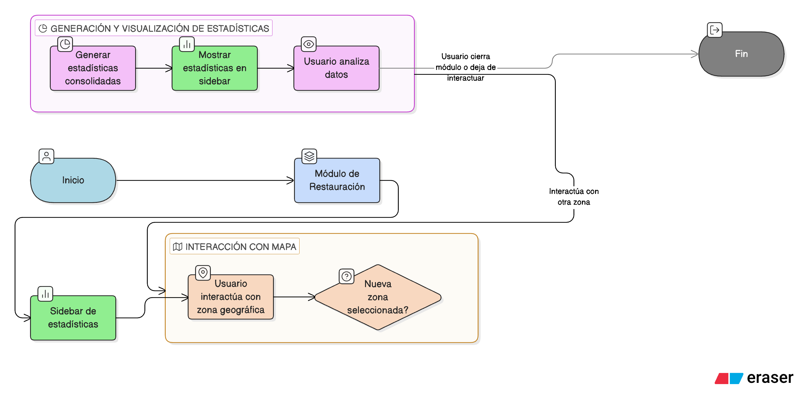

# HU-IDEAM-SNIF-REST-017

> **Identificador Historia de Usuario:** hu-ideam-snif-rest-017\
> **Nombre Historia de Usuario:** Panel de estadísticas en el sidebar

> **Sistema de información:** Sistema Nacional de Información Forestal\
> **Módulo / subsistema:** Módulo de restauración\
> **Validador temático(s):** Raymond Alexander Jiménez Arteaga

## DESCRIPCIÓN HISTORIA DE USUARIO

> **Como:** usuario del SNIF.\
> **Quiero:** visualizar estadísticas consolidadas en el sidebar.\
> **Para:** analizar datos al interactuar con zonas geográficas desde el visor.

## CRITERIOS DE ACEPTACIÓN

1. **Panel de estadísticas**  
   1.1 El sistema debe mostrar estadísticas consolidadas en el sidebar.

2. **Interacción geográfica**  
   2.1 Las estadísticas se generan al interactuar con zonas geográficas desde el visor.

## ROLES

- **Todos los perfiles:** Pueden visualizar estadísticas.

## RESTRICCIONES Y LÍMITES

- Las estadísticas se muestran en el sidebar.
- Se actualizan según la interacción con el mapa.

## DIAGRAMA DE FLUJO DEL PROCESO

