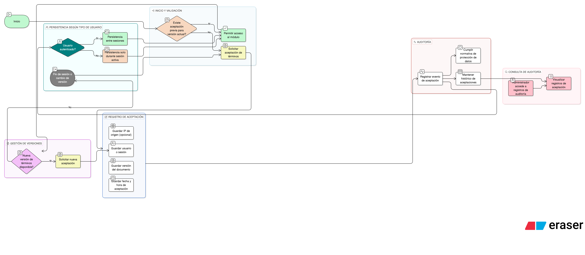

# HU-IDEAM-SNIF-REST-025

> **Identificador Historia de Usuario:** hu-ideam-snif-rest-025\
> **Nombre Historia de Usuario:** Persistencia de aceptación de términos

> **Sistema de información:** Sistema Nacional de Información Forestal\
> **Módulo / subsistema:** Módulo de restauración\
> **Validador temático(s):** Raymond Alexander Jiménez Arteaga

## DESCRIPCIÓN HISTORIA DE USUARIO

> **Como:** sistema.\
> **Quiero:** registrar la aceptación de los términos.\
> **Para:** mantener trazabilidad legal y evitar solicitudes repetidas innecesarias.

## CRITERIOS DE ACEPTACIÓN

1. **Registro de aceptación**  
   1.1 El sistema debe registrar:  
   - Usuario o tipo de sesión (invitado).  
   - Fecha y hora de aceptación.  
   - Versión del documento aceptado.

2. **Gestión de versiones**  
   2.1 Si la versión del documento cambia:  
   - Se solicita nuevamente la aceptación al usuario.  
   2.2 El sistema identifica automáticamente cuando hay una nueva versión disponible.

3. **Auditoría**  
   3.1 Evento: Aceptación de términos y condiciones.  
   3.2 El registro de auditoría debe incluir:  
   - Identificación del usuario o sesión.  
   - Marca temporal.  
   - Versión del documento aceptada.  
   - IP de origen (opcional).

4. **Persistencia**  
   4.1 La aceptación se mantiene durante toda la sesión activa.  
   4.2 Para usuarios autenticados, la aceptación persiste entre sesiones (hasta que cambie la versión).  
   4.3 Para usuarios invitados, la aceptación es válida solo durante la sesión activa.

## ROLES

- **Sistema:** Responsable de registrar y gestionar la persistencia de aceptaciones.

- **Administrador IDEAM:** Puede consultar registros de auditoría de aceptaciones.

- **Todos los usuarios (autenticados e invitados):** Sujetos a la validación de aceptación de términos.

## RESTRICCIONES Y LÍMITES

- La persistencia de aceptación para usuarios invitados es limitada a la sesión activa.
- Cada cambio de versión del documento requiere nueva aceptación explícita.
- Los registros de auditoría deben cumplir con normativa de protección de datos personales.
- El sistema debe mantener histórico de aceptaciones para fines legales.

## DIAGRAMA DE FLUJO DEL PROCESO

