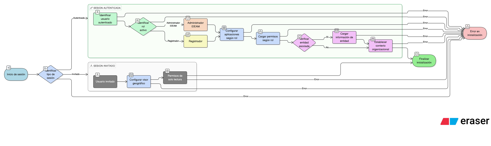

# HU-IDEAM-SNIF-REST-026

> **Identificador Historia de Usuario:** hu-ideam-snif-rest-026\
> **Nombre Historia de Usuario:** Inicialización del contexto del usuario

> **Sistema de información:** Sistema Nacional de Información Forestal\
> **Módulo / subsistema:** Módulo de restauración\
> **Validador temático(s):** Raymond Alexander Jiménez Arteaga

## DESCRIPCIÓN HISTORIA DE USUARIO

> **Como:** sistema.\
> **Quiero:** inicializar el contexto del usuario.\
> **Para:** configurar los módulos, aplicaciones y funcionalidades disponibles.

## CRITERIOS DE ACEPTACIÓN

1. **Identificación del rol activo**  
   1.1 El sistema debe identificar y cargar el rol activo del usuario:  
   - Administrador IDEAM.  
   - Registrador.  
   - Invitado.

2. **Aplicaciones habilitadas según rol**  
   2.1 El sistema debe configurar las aplicaciones disponibles según el rol:  
   - **Visor geográfico:** Disponible para todos los roles.  
   - **Gestión:** Disponible para Administrador IDEAM y Registrador.  
   - **Administración:** Disponible solo para Administrador IDEAM.

3. **Entidad asociada**  
   3.1 Si el usuario pertenece a una entidad específica:  
   - El sistema carga la información de la entidad asociada.  
   - Se establece el contexto organizacional del usuario.  
   3.2 Para usuarios invitados, no aplica entidad asociada.

4. **Permisos funcionales**  
   4.1 El sistema debe cargar los permisos específicos según el rol:  
   - Permisos de lectura/escritura.  
   - Permisos de validación.  
   - Permisos de administración.  
   4.2 Los permisos se validan en cada operación del usuario.

5. **Tipo de sesión**  
   5.1 El sistema debe identificar y registrar el tipo de sesión:  
   - Autenticado (con credenciales vía Keycloak).  
   - Invitado (acceso sin autenticación).  
   5.2 El tipo de sesión determina la persistencia de datos y preferencias.

6. **Inicialización del contexto**  
   6.1 La inicialización debe completarse antes de permitir el acceso a cualquier módulo.  
   6.2 En caso de error en la inicialización, el sistema debe mostrar mensaje apropiado.  
   6.3 El contexto se mantiene durante toda la sesión activa.

## ROLES

- **Sistema:** Responsable de inicializar y mantener el contexto del usuario.

- **Administrador IDEAM:** Acceso completo a todas las aplicaciones (Visor, Gestión, Administración).

- **Registrador:** Acceso a Visor geográfico y Gestión.

- **Usuario Consulta / Invitado:** Acceso solo a Visor geográfico.

## RESTRICCIONES Y LÍMITES

- La inicialización del contexto es obligatoria antes de acceder a cualquier funcionalidad.
- Los permisos son estrictos y no pueden ser modificados durante la sesión.
- El cambio de rol requiere nueva autenticación o reinicio de sesión.
- Para usuarios invitados, las funcionalidades están limitadas exclusivamente al visor de consulta.
- La entidad asociada solo aplica para usuarios autenticados con roles específicos.

## DIAGRAMA DE FLUJO DEL PROCESO

