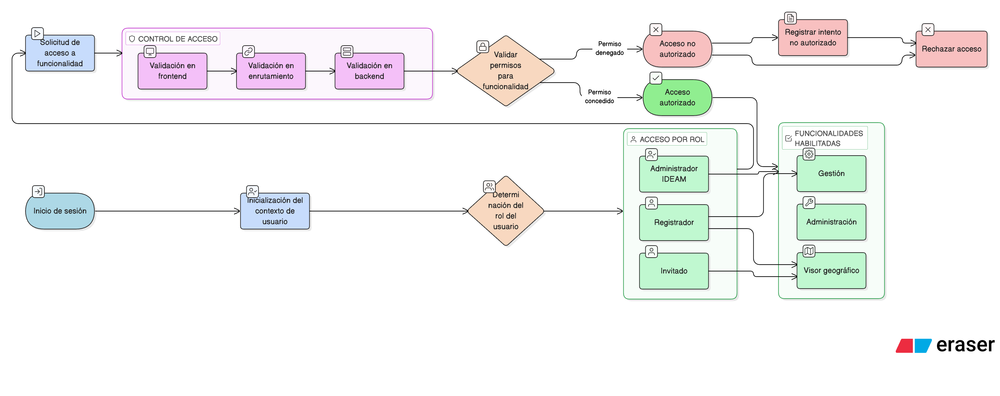

# HU-IDEAM-SNIF-REST-027

> **Identificador Historia de Usuario:** hu-ideam-snif-rest-027\
> **Nombre Historia de Usuario:** Control de acceso a funcionalidades según rol

> **Sistema de información:** Sistema Nacional de Información Forestal\
> **Módulo / subsistema:** Módulo de restauración\
> **Validador temático(s):** Raymond Alexander Jiménez Arteaga

## DESCRIPCIÓN HISTORIA DE USUARIO

> **Como:** sistema.\
> **Quiero:** habilitar o restringir funcionalidades desde el inicio.\
> **Para:** garantizar seguridad y segregación de funciones.

## CRITERIOS DE ACEPTACIÓN

1. **Habilitación de aplicaciones según perfil**  
   1.1 El sistema debe habilitar las aplicaciones del Módulo de Restauración según el perfil:  
   - **Administrador IDEAM:**  
     - Accede a Visor geográfico, Gestión y Administración.  
   - **Registrador:**  
     - Accede a Visor geográfico y Gestión.  
   - **Invitado:**  
     - Accede únicamente al Visor geográfico.

2. **Restricción de aplicaciones no autorizadas**  
   2.1 Las aplicaciones no autorizadas:  
   - No se renderizan en la interfaz.  
   - No son accesibles por URL directa.  
   - No pueden ser invocadas por API.

3. **Validación de acceso**  
   3.1 El sistema debe validar permisos en cada intento de acceso.  
   3.2 Los intentos de acceso no autorizado deben ser rechazados y registrados.

4. **Seguridad en múltiples capas**  
   4.1 El control de acceso se aplica en:  
   - Frontend (renderizado de componentes).  
   - Enrutamiento (URLs).  
   - Backend (endpoints de API).

## ROLES

- **Sistema:** Responsable de aplicar y validar las restricciones de acceso.

- **Administrador IDEAM:** Acceso completo a todas las aplicaciones del módulo.

- **Registrador:** Acceso limitado a Visor geográfico y Gestión.

- **Usuario Consulta / Invitado:** Acceso exclusivo al Visor geográfico.

## RESTRICCIONES Y LÍMITES

- Las restricciones de acceso son estrictas y no pueden ser modificadas sin cambio de rol.
- Los intentos de acceso no autorizado deben ser auditados.
- El control de acceso se aplica desde la inicialización del contexto del usuario.
- No se permite escalamiento de privilegios durante la sesión activa.

## DIAGRAMA DE FLUJO DEL PROCESO

