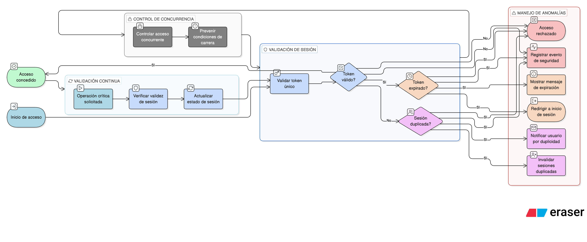

# HU-IDEAM-SNIF-REST-029

> **Identificador Historia de Usuario:** hu-ideam-snif-rest-029\
> **Nombre Historia de Usuario:** Unicidad y control de sesión activa

> **Sistema de información:** Sistema Nacional de Información Forestal\
> **Módulo / subsistema:** Módulo de restauración\
> **Validador temático(s):** Raymond Alexander Jiménez Arteaga

## DESCRIPCIÓN HISTORIA DE USUARIO

> **Como:** sistema.\
> **Quiero:** controlar la unicidad de la sesión.\
> **Para:** evitar accesos inconsistentes o inválidos.

## CRITERIOS DE ACEPTACIÓN

1. **Sesión única por token**  
   1.1 El sistema debe mantener una sesión activa por token.  
   1.2 No se permiten múltiples sesiones simultáneas con el mismo token.

2. **Detección de anomalías de sesión**  
   2.1 El sistema debe detectar:  
   - **Sesión expirada:** Token vencido por timeout.  
   - **Token inválido:** Token manipulado o corrupto.  
   - **Sesión duplicada:** Intento de uso simultáneo del mismo token.

3. **Acciones ante anomalías**  
   3.1 **Sesión expirada:**  
   - Redirigir a pantalla de inicio de sesión.  
   - Mostrar mensaje informativo de expiración.  
   3.2 **Token inválido:**  
   - Rechazar acceso inmediatamente.  
   - Registrar evento de seguridad.  
   3.3 **Sesión duplicada:**  
   - Invalidar sesiones duplicadas.  
   - Notificar al usuario.

4. **Manejo de concurrencia**  
   4.1 El sistema debe controlar accesos concurrentes de forma segura.  
   4.2 Se previenen condiciones de carrera en validación de sesiones.

5. **Validación continua**  
   5.1 La validez de la sesión se verifica en cada operación crítica.  
   5.2 El sistema actualiza automáticamente el estado de la sesión.

## ROLES

- **Sistema:** Responsable del control y validación de sesiones.

- **Todos los usuarios:** Sujetos al control de unicidad de sesión.

## RESTRICCIONES Y LÍMITES

- Solo se permite una sesión activa por token de autenticación.
- Las sesiones expiradas no pueden ser reactivadas.
- Los intentos de manipulación de token son registrados como eventos de seguridad.
- El tiempo de expiración de sesión es configurable a nivel de sistema.
- El sistema debe manejar desconexiones de red sin perder la integridad de la sesión.

## DIAGRAMA DE FLUJO DEL PROCESO

