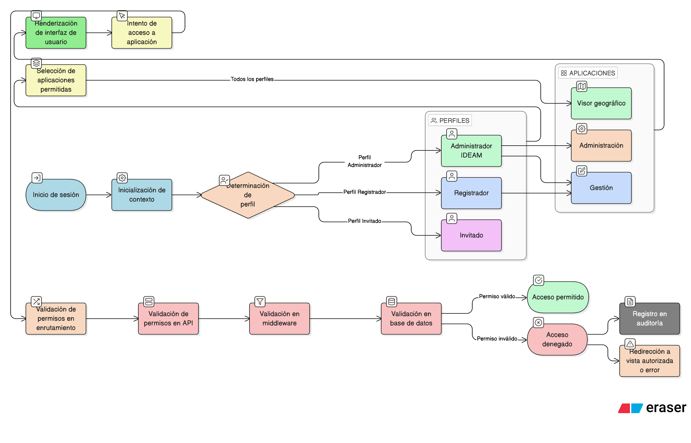

# HU-IDEAM-SNIF-REST-033

> **Identificador Historia de Usuario:** hu-ideam-snif-rest-033\
> **Nombre Historia de Usuario:** Regla institucional de acceso a aplicaciones del Módulo de Restauración

> **Sistema de información:** Sistema Nacional de Información Forestal\
> **Módulo / subsistema:** Módulo de restauración\
> **Validador temático(s):** Raymond Alexander Jiménez Arteaga

## DESCRIPCIÓN HISTORIA DE USUARIO

> **Como:** sistema.\
> **Quiero:** aplicar la regla institucional de acceso a aplicaciones del Módulo de Restauración.\
> **Para:** garantizar que el acceso se defina estrictamente por el perfil del usuario desde el momento de inicialización del contexto.

## CRITERIOS DE ACEPTACIÓN

1. **Definición estricta por perfil**  
   1.1 El acceso a las aplicaciones internas del Módulo de Restauración se define exclusivamente por el perfil del usuario:  
   - **Administrador IDEAM:** Visor geográfico, Gestión y Administración.  
   - **Registrador:** Visor geográfico y Gestión.  
   - **Invitado:** Visor geográfico únicamente.

2. **Aplicación desde inicialización del contexto**  
   2.1 Las reglas de acceso se aplican desde el momento de la inicialización del contexto del usuario.  
   2.2 No se permite modificación de permisos durante la sesión activa.

3. **Control a nivel de interfaz**  
   3.1 La interfaz solo renderiza las aplicaciones autorizadas para el perfil.  
   3.2 Las aplicaciones no autorizadas no son visibles ni accesibles desde la UI.

4. **Control a nivel de API**  
   4.1 Todos los endpoints de API validan el perfil del usuario antes de ejecutar operaciones.  
   4.2 Las solicitudes no autorizadas son rechazadas con código de error apropiado (403 Forbidden).  
   4.3 Los intentos de acceso no autorizado son registrados en auditoría.

5. **Control de enrutamiento**  
   5.1 El sistema de enrutamiento valida permisos antes de cargar vistas.  
   5.2 Los accesos directos por URL a aplicaciones no autorizadas son bloqueados.  
   5.3 Se redirige al usuario a una vista autorizada o página de error.

6. **Consistencia en múltiples capas**  
   6.1 La regla se aplica consistentemente en:  
   - Frontend (React/Angular/Vue).  
   - Backend (APIs REST).  
   - Servicios intermedios (middleware).  
   - Base de datos (permisos de lectura/escritura).

## ROLES

- **Sistema:** Responsable de aplicar y mantener las reglas institucionales de acceso.

- **Administrador IDEAM:** Perfil con acceso completo a todas las aplicaciones.

- **Registrador:** Perfil con acceso limitado según regla institucional.

- **Usuario Consulta / Invitado:** Perfil con acceso mínimo según regla institucional.

## RESTRICCIONES Y LÍMITES

- Las reglas institucionales son inmutables durante la sesión activa.
- No se permite escalamiento de privilegios por ningún medio.
- Cualquier cambio en reglas institucionales requiere actualización formal del sistema.
- Los controles de acceso deben ser auditables y verificables.
- La regla se aplica independientemente del canal de acceso (web, móvil, API).

## DIAGRAMA DE FLUJO DEL PROCESO

