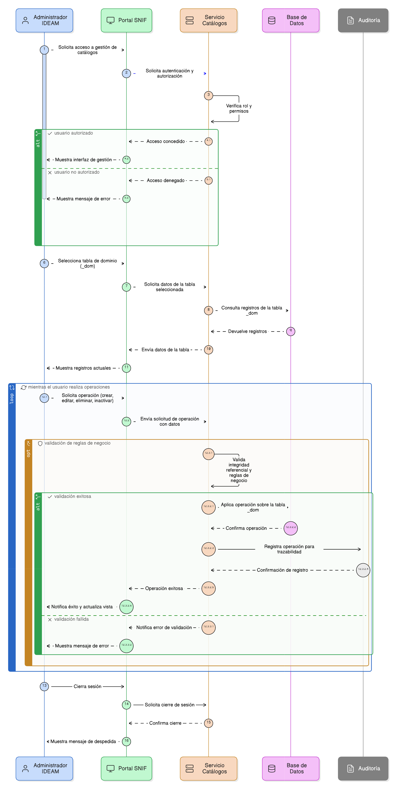

# Épica 002: Administración de Catálogos (Tablas de dominio _dom)

## 1. Descripción general

Esta épica define la administración centralizada de las tablas de dominio (_dom) utilizadas de forma transversal en el módulo de restauración del Sistema Nacional de Información Forestal (SNIF).

Las tablas _dom constituyen el soporte semántico del sistema y permiten garantizar la estandarización, coherencia y control de los valores utilizados en formularios, procesos y validaciones del módulo de restauración.

La gestión de estos catálogos está restringida al rol **Administrador IDEAM**, bajo reglas de negocio que aseguran la integridad referencial, la trazabilidad de los cambios y el control institucional de la información.

---

## 2. Objetivo

Permitir la **gestión centralizada, controlada y trazable de las tablas de dominio (_dom)** utilizadas transversalmente en el módulo de restauración del SNIF, garantizando la coherencia semántica, la integridad referencial y el cumplimiento de las reglas de negocio del sistema.

- Coherencia semántica de los valores utilizados en el sistema.
- Integridad referencial entre catálogos y registros operativos.
- Cumplimiento de las reglas de negocio definidas por el IDEAM.
- Control de acceso por rol.
- Trazabilidad completa de las operaciones realizadas sobre los catálogos.

---

## 3. Historias de usuario asociadas

- [**HU-IDEAM-SNIF-REST-034:** Listar tablas de dominio (_dom)](/historias_usuario/EP-IDEAM-SNIF-REST-002/HU-IDEAM-SNIF-REST-034.md)
- [**HU-IDEAM-SNIF-REST-035:** Listar registros de una tabla de dominio](/historias_usuario/EP-IDEAM-SNIF-REST-002/HU-IDEAM-SNIF-REST-035.md)
- [**HU-IDEAM-SNIF-REST-036:** Crear un nuevo registro en tabla de dominio](/historias_usuario/EP-IDEAM-SNIF-REST-002/HU-IDEAM-SNIF-REST-036.md)
- [**HU-IDEAM-SNIF-REST-037:** Editar un registro de tabla de dominio](/historias_usuario/EP-IDEAM-SNIF-REST-002/HU-IDEAM-SNIF-REST-037.md)
- [**HU-IDEAM-SNIF-REST-038:** Activar o desactivar registros de dominio (borrado lógico)](/historias_usuario/EP-IDEAM-SNIF-REST-002/HU-IDEAM-SNIF-REST-038.md)
- [**HU-IDEAM-SNIF-REST-039:** Consulta de valores de dominio por usuarios no administradores](/historias_usuario/EP-IDEAM-SNIF-REST-002/HU-IDEAM-SNIF-REST-039.md)
- [**HU-IDEAM-SNIF-REST-040:** Validación de integridad referencial de valores de dominio](/historias_usuario/EP-IDEAM-SNIF-REST-002/HU-IDEAM-SNIF-REST-040.md)
- [**HU-IDEAM-SNIF-REST-041:** Auditoría de cambios en tablas de dominio](/historias_usuario/EP-IDEAM-SNIF-REST-002/HU-IDEAM-SNIF-REST-041.md)
- [**HU-IDEAM-SNIF-REST-042:** Control de acceso por rol en tablas de dominio](/historias_usuario/EP-IDEAM-SNIF-REST-002/HU-IDEAM-SNIF-REST-042.md)
- [**HU-IDEAM-SNIF-REST-043:** Impacto controlado de cambios de dominio en formularios](/historias_usuario/EP-IDEAM-SNIF-REST-002/HU-IDEAM-SNIF-REST-043.md)
- [**HU-IDEAM-SNIF-REST-044:** Validación de unicidad en tablas de dominio](/historias_usuario/EP-IDEAM-SNIF-REST-002/HU-IDEAM-SNIF-REST-044.md)

---

## 4. Riesgos

- Uso de valores inconsistentes en formularios si no se controlan los catálogos.
- Duplicidad semántica de valores de dominio.
- Pérdida de trazabilidad de cambios en las tablas _dom.
- Uso de valores inactivos en nuevos registros.
- Modificaciones no autorizadas a catálogos críticos del sistema.

---

## 5. Diagrama de secuencia

---

## 6. Wireframes / mockups
