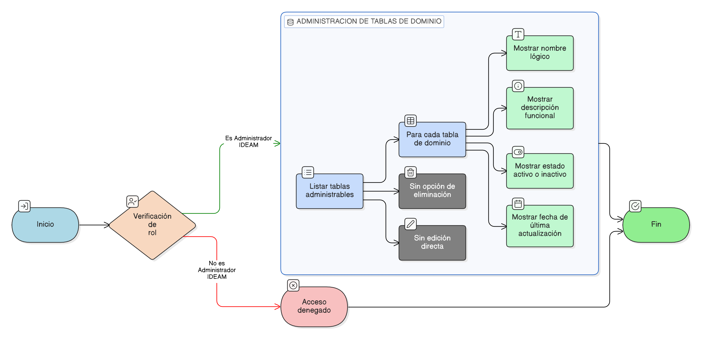

# HU-IDEAM-SNIF-REST-034

> **Identificador Historia de Usuario:** hu-ideam-snif-rest-034/
> **Nombre Historia de Usuario:** Listar tablas de dominio (_dom)

> **Sistema de información:** Sistema Nacional de Información Forestal/
> **Módulo / subsistema:** Módulo de restauración/
> **Validador temático(s):** Raymond Alexander Jiménez Arteaga

## DESCRIPCIÓN HISTORIA DE USUARIO

> **Como:** administrador del sistema./
> **Quiero:** visualizar el listado de todas las tablas de dominio (_dom) configuradas en el sistema./
> **Para:** acceder a su administración de forma centralizada y controlada.

## CRITERIOS DE ACEPTACIÓN

1. **Listado de tablas de dominio**  
   1.1 El sistema debe listar únicamente las tablas de dominio marcadas como administrables.  
   1.2 El listado debe presentarse en una vista centralizada de administración.

2. **Información mínima por tabla**  
   2.1 Para cada tabla de dominio se debe mostrar como mínimo:  
   - Nombre lógico de la tabla.  
   - Descripción funcional.  
   - Estado (activo / inactivo).  
   - Fecha de última actualización.

3. **Restricción de eliminación**  
   3.1 El sistema no debe permitir la eliminación de tablas de dominio (_dom) desde la interfaz de usuario.  

## ROLES

- **Administrador IDEAM:**  Puede acceder a la administración y visualización de las tablas de dominio.

- **Registrador:**  No puede acceder a la administración de las tablas de dominio. Solo consume sus valores a través de los formularios del sistema.

- **Usuario Consulta:**  No puede acceder a la administración de las tablas de dominio.

## RESTRICCIONES Y LÍMITES

- Las tablas de dominio (_dom) no pueden eliminarse desde la interfaz gráfica.
- El acceso a esta funcionalidad está restringido por rol.
- La visualización no implica edición directa de registros.

## DIAGRAMA DE FLUJO DEL PROCESO

