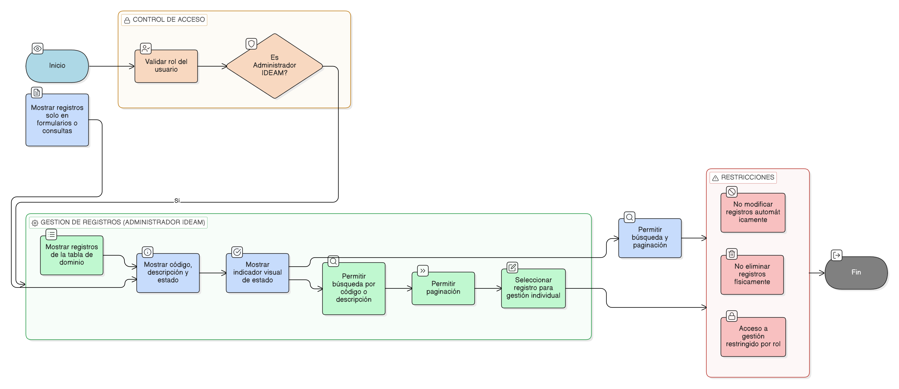

# HU-IDEAM-SNIF-REST-035

> **Identificador Historia de Usuario:** hu-ideam-snif-rest-035\
> **Nombre Historia de Usuario:** Listar registros de una tabla de dominio (_dom)

> **Sistema de información:** Sistema Nacional de Información Forestal\
> **Módulo / subsistema:** Módulo de restauración\
> **Validador temático(s):** Raymond Alexander Jiménez Arteaga

## DESCRIPCIÓN HISTORIA DE USUARIO

> **Como:** administrador del sistema.\
> **Quiero:** visualizar los registros asociados a una tabla de dominio (_dom) específica.\
> **Para:** gestionarlos individualmente de forma controlada y trazable.

## CRITERIOS DE ACEPTACIÓN

1. **Visualización de registros**  
   1.1 El sistema debe mostrar todos los registros asociados a la tabla de dominio seleccionada.  
   1.2 Se deben listar tanto los registros activos como inactivos.

2. **Información mínima por registro**  
   2.1 Para cada registro de dominio se debe mostrar como mínimo:  
   - Código del valor.  
   - Descripción.  
   - Estado (activo / inactivo).

3. **Herramientas de consulta**  
   3.1 El sistema debe permitir la búsqueda de registros por código y por descripción.  
   3.2 El listado debe contar con paginación para facilitar la navegación.

4. **Indicador de estado**  
   4.1 Cada registro debe incluir un indicador visual que permita identificar su estado (activo o inactivo).

## ROLES

- **Administrador IDEAM:**  Puede visualizar y gestionar los registros de las tablas de dominio (_dom).

- **Registrador:**  No puede acceder a la administración de los registros de dominio. Visualiza los valores de dominio únicamente a través de los formularios de aplicación del módulo de restauración.

- **Usuario Consulta:**  No puede acceder a la administración de los registros de dominio. Visualiza los valores de dominio únicamente desde las opciones de consulta de proyectos y áreas restauradas aprobadas.

## RESTRICCIONES Y LÍMITES

- La visualización de registros no implica modificación automática de los mismos.
- El acceso a la gestión de registros está restringido por rol.
- No se permite la eliminación física de registros de dominio.

## DIAGRAMA DE FLUJO DEL PROCESO

