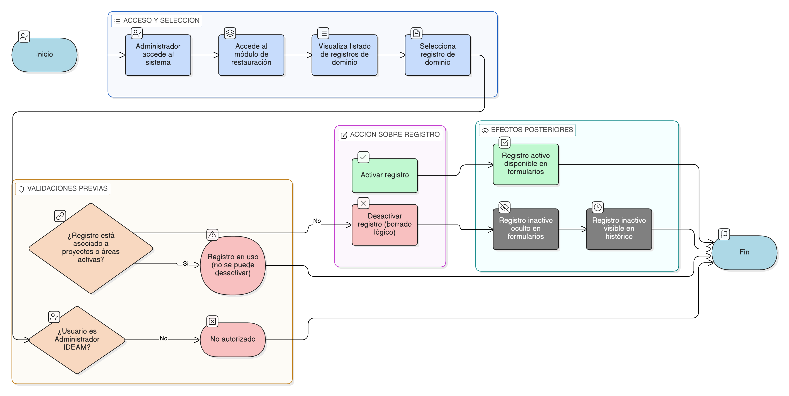

# HU-IDEAM-SNIF-REST-038

> **Identificador Historia de Usuario:** hu-ideam-snif-rest-038\
> **Nombre Historia de Usuario:** Activar o desactivar registros de dominio (_dom) (borrado lógico)

> **Sistema de información:** Sistema Nacional de Información Forestal\
> **Módulo / subsistema:** Módulo de restauración\
> **Validador temático(s):** Raymond Alexander Jiménez Arteaga

## DESCRIPCIÓN HISTORIA DE USUARIO

> **Como:** administrador del sistema.\
> **Quiero:** activar o desactivar un registro de dominio (_dom).\
> **Para:** controlar su uso futuro en el sistema sin perder trazabilidad ni afectar información histórica.

## CRITERIOS DE ACEPTACIÓN

1. **Acceso a la funcionalidad de activación / desactivación**  
   1.1 El sistema debe permitir activar o desactivar registros de dominio únicamente a usuarios con rol Administrador IDEAM.  
   1.2 La opción debe estar disponible desde el listado de registros de una tabla _dom específica.

2. **Borrado lógico de registros**  
   2.1 El sistema no debe permitir la eliminación física de registros de dominio.  
   2.2 La desactivación de un registro debe corresponder a un borrado lógico.

3. **Restricciones por uso del registro**  
   3.1 El sistema no debe permitir desactivar un registro de dominio si este se encuentra asociado a proyectos o áreas restauradas activas.  

4. **Efectos de la desactivación**  
   4.1 Un registro desactivado no debe aparecer en listas desplegables ni combos de formularios para nuevos registros.  
   4.2 El registro debe mantenerse visible en los registros históricos asociados.

5. **Efectos de la activación**  
   5.1 Un registro activado debe quedar disponible nuevamente para su selección en los formularios del sistema.

## ROLES

- **Administrador IDEAM:**  Puede activar o desactivar registros de dominio (_dom) conforme a las reglas del sistema.

- **Registrador:**  No puede activar ni desactivar registros de dominio. Consume únicamente valores de dominio activos a través de los formularios del sistema.

- **Usuario Consulta:**  No puede activar ni desactivar registros de dominio. Visualiza únicamente valores de dominio activos en información validada.

## RESTRICCIONES Y LÍMITES

- No se permite la eliminación física de registros de dominio.
- No se permite desactivar registros en uso por proyectos activos.
- El borrado lógico debe preservar la trazabilidad histórica.
- El acceso a esta funcionalidad está restringido por rol.

## DIAGRAMA DE FLUJO DEL PROCESO

