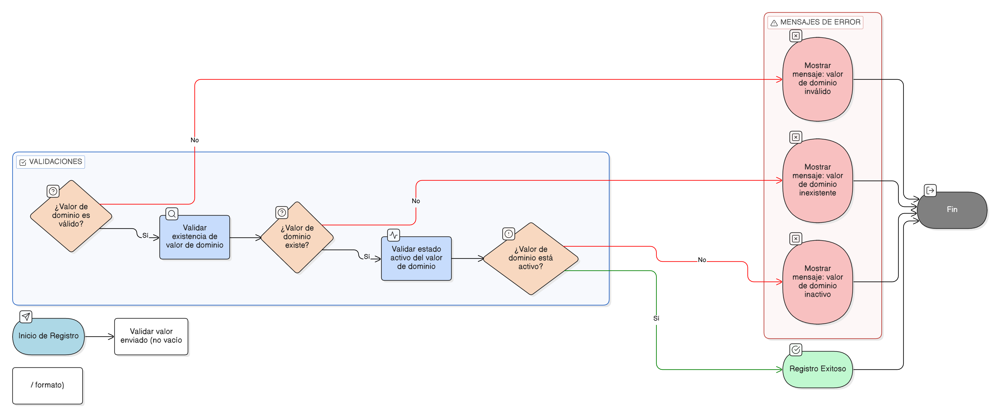

# HU-IDEAM-SNIF-REST-040

> **Identificador Historia de Usuario:** hu-ideam-snif-rest-040\
> **Nombre Historia de Usuario:** Validación de integridad referencial de valores de dominio (_dom)

> **Sistema de información:** Sistema Nacional de Información Forestal\
> **Módulo / subsistema:** Módulo de restauración\
> **Validador temático(s):** Raymond Alexander Jiménez Arteaga

## DESCRIPCIÓN HISTORIA DE USUARIO

> **Como:** sistema.\
> **Quiero:** validar que los valores de dominio (_dom) utilizados en proyectos y áreas restauradas existan y se encuentren vigentes.\
> **Para:** evitar inconsistencias, errores de registro y uso de valores no válidos dentro del módulo de restauración del SNIF.

## CRITERIOS DE ACEPTACIÓN

1. **Validación al guardar información**  
   1.1 El sistema debe validar que todo valor de dominio seleccionado exista en la tabla _dom correspondiente.  
   1.2 No se debe permitir guardar un proyecto o área restaurada con valores de dominio inexistentes.

2. **Validación de vigencia del valor**  
   2.1 El sistema debe validar que el valor de dominio utilizado se encuentre en estado **Activo** al momento del registro.  
   2.2 Si un valor de dominio pasa a estado inactivo, no debe afectar los registros previamente guardados.

3. **Bloqueo de nuevos usos**  
   3.1 Cuando un valor de dominio sea marcado como inactivo, el sistema debe bloquear su uso para nuevos registros.  

4. **Mensajes de validación**  
   4.1 En caso de error, el sistema debe mostrar un mensaje claro indicando que el valor seleccionado no es válido o no se encuentra vigente.

## ROLES

- **Administrador IDEAM:**  A través de las herramientas propias del sistema, valida que los valores de dominio utilizados existan y estén vigentes, garantizando la integridad referencial.

- **Registrador:**  A través de los formularios de aplicación, utiliza valores de dominio validados por el sistema y no puede guardar información con valores inexistentes o inactivos.

- **Usuario Consulta:** No puede realizar esta actividad.

## RESTRICCIONES Y LÍMITES

- No se permite el uso de valores de dominio inexistentes.
- Los valores inactivos no afectan registros históricos ya guardados.
- La validación es obligatoria antes de permitir el guardado de información.
- Esta funcionalidad es ejecutada automáticamente por el sistema.

## DIAGRAMA DE FLUJO DEL PROCESO

