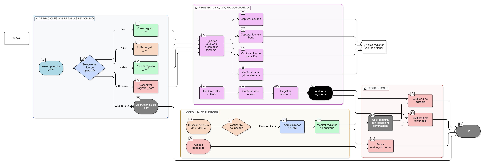

# HU-IDEAM-SNIF-REST-041

> **Identificador Historia de Usuario:** hu-ideam-snif-rest-041\
> **Nombre Historia de Usuario:** Auditoría de cambios en tablas de dominio (_dom)

> **Sistema de información:** Sistema Nacional de Información Forestal\
> **Módulo / subsistema:** Módulo de restauración\
> **Validador temático(s):** Raymond Alexander Jiménez Arteaga

## DESCRIPCIÓN HISTORIA DE USUARIO

> **Como:** administrador del sistema.\
> **Quiero:** registrar todas las operaciones realizadas sobre las tablas de dominio (_dom).\
> **Para:** garantizar trazabilidad, control institucional y auditoría de los cambios realizados en los catálogos del sistema.

## CRITERIOS DE ACEPTACIÓN

1. **Registro automático de operaciones**  
   1.1 El sistema debe registrar automáticamente toda operación realizada sobre las tablas de dominio (_dom).  
   1.2 Las operaciones auditadas deben incluir: crear, editar, activar y desactivar registros.

2. **Información registrada en auditoría**  
   2.1 Por cada operación se debe registrar como mínimo:  
   - Usuario que realizó la acción.  
   - Fecha y hora de la operación.  
   - Tipo de operación realizada.  
   - Tabla de dominio afectada.  
   - Valor anterior y valor nuevo del registro, cuando aplique.

3. **Disponibilidad de la información de auditoría**  
   3.1 Los registros de auditoría deben estar disponibles para consulta por el Administrador IDEAM.  
   3.2 La información de auditoría no debe ser editable ni eliminable desde la interfaz.

## ROLES

- **Administrador IDEAM:**  Puede consultar los registros de auditoría asociados a las operaciones realizadas sobre las tablas de dominio (_dom).

- **Registrador:**  No puede acceder a los registros de auditoría.

- **Usuario Consulta:**  No puede acceder a los registros de auditoría.

## RESTRICCIONES Y LÍMITES

- Los registros de auditoría no pueden ser modificados ni eliminados.
- La auditoría debe ejecutarse de forma automática por el sistema.
- El acceso a la información de auditoría está restringido por rol.

## DIAGRAMA DE FLUJO DEL PROCESO

