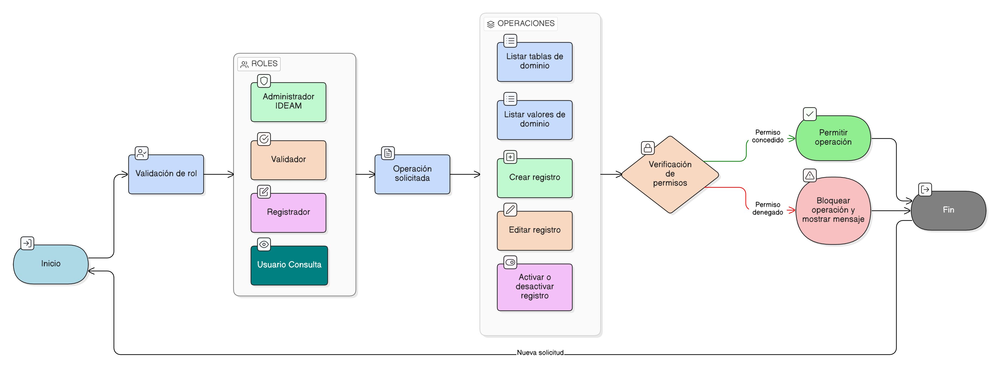

# HU-IDEAM-SNIF-REST-042

> **Identificador Historia de Usuario:** hu-ideam-snif-rest-042\
> **Nombre Historia de Usuario:** Control de acceso por rol en tablas de dominio (_dom)

> **Sistema de información:** Sistema Nacional de Información Forestal\
> **Módulo / subsistema:** Módulo de restauración\
> **Validador temático(s):** Raymond Alexander Jiménez Arteaga

## DESCRIPCIÓN HISTORIA DE USUARIO

> **Como:** sistema.\
> **Quiero:** restringir las operaciones CRUD sobre las tablas de dominio (_dom) según el rol del usuario.\
> **Para:** garantizar la seguridad, la gobernanza del dato y el cumplimiento de las reglas institucionales del módulo de restauración del SNIF.

## CRITERIOS DE ACEPTACIÓN

1. **Control de acceso por rol**  
   1.1 El sistema debe validar el rol del usuario antes de permitir cualquier operación sobre las tablas de dominio (_dom).  
   1.2 Los roles considerados para el control de acceso son: Administrador IDEAM, Validador, Registrador y Usuario Consulta.  
   1.3 Las operaciones permitidas sobre las tablas de dominio (_dom) deben definirse y aplicarse estrictamente según el rol del usuario.

2. **Matriz de permisos funcionales**  
   2.1 El sistema debe aplicar la siguiente matriz de control de acceso sobre las tablas de dominio (_dom):

   | Operación | Administrador IDEAM | Validador | Registrador | Usuario Consulta |
   |----------|---------------------|-----------|-------------|------------------|
   | Listar tablas _dom | ✔️ | ✔️ | ❌ | ❌ |
   | Listar valores _dom | ✔️ | ✔️ | ✔️ (solo activos) | ✔️ (solo activos) |
   | Crear registros | ✔️ | ❌ | ❌ | ❌ |
   | Editar registros | ✔️ | ❌ | ❌ | ❌ |
   | Activar / Desactivar registros | ✔️ | ❌ | ❌ | ❌ |

3. **Restricción de operaciones no autorizadas**  
   3.1 El sistema no debe permitir la ejecución de operaciones no autorizadas según el rol.  
   3.2 En caso de intento de acceso no permitido, el sistema debe bloquear la acción y mostrar un mensaje informativo.

## ROLES

- **Administrador IDEAM:**  Puede ejecutar todas las operaciones de administración sobre las tablas de dominio (_dom) conforme a la matriz de permisos.

- **Registrador:**  Puede visualizar y utilizar únicamente valores de dominio activos a través de los formularios del sistema.

- **Usuario Consulta:**  Puede visualizar únicamente valores de dominio activos en información validada.

## RESTRICCIONES Y LÍMITES

- El control de acceso debe aplicarse de forma obligatoria en todas las operaciones sobre tablas de dominio.
- No se deben permitir accesos implícitos ni excepciones por interfaz.
- La validación de permisos debe realizarse tanto en frontend como en backend.

## DIAGRAMA DE FLUJO DEL PROCESO

