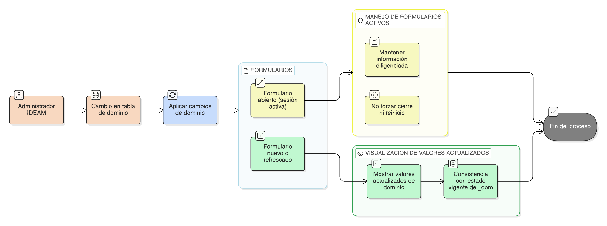

# HU-IDEAM-SNIF-REST-043

> **Identificador Historia de Usuario:** hu-ideam-snif-rest-043\
> **Nombre Historia de Usuario:** Impacto controlado de cambios de dominio (_dom) en formularios

> **Sistema de información:** Sistema Nacional de Información Forestal\
> **Módulo / subsistema:** Módulo de restauración\
> **Validador temático(s):** Raymond Alexander Jiménez Arteaga

## DESCRIPCIÓN HISTORIA DE USUARIO

> **Como:** sistema.\
> **Quiero:** que los cambios realizados en las tablas de dominio (_dom) se reflejen de forma controlada en los formularios del módulo de restauración.\
> **Para:** mantener la coherencia de la información sin afectar sesiones activas ni provocar pérdida de datos.

## CRITERIOS DE ACEPTACIÓN

1. **Propagación controlada de cambios**  
   1.1 El sistema debe reflejar los cambios realizados en las tablas de dominio (_dom) en los formularios del módulo de restauración de forma controlada.  
   1.2 Los cambios deben aplicarse únicamente en nuevas sesiones o mediante un refresco controlado de la información.

2. **Persistencia de información en formularios activos**  
   2.1 Los formularios que se encuentren abiertos al momento de un cambio en tablas _dom no deben perder la información diligenciada.  
   2.2 El sistema no debe forzar el cierre ni el reinicio automático de formularios activos.

3. **Consistencia de los valores mostrados**  
   3.1 Los valores de dominio disponibles en los formularios deben corresponder al estado vigente de las tablas _dom al momento de su carga.  

## ROLES

- **Administrador IDEAM:**  Los cambios que realice sobre la administración de las tablas de dominio (_dom) se reflejan de forma controlada en los formularios del sistema.

- **Registrador:**  Visualiza los cambios en valores de dominio (_dom) en los formularios del sistema conforme a las reglas de actualización establecidas.

- **Usuario Consulta:**  No participa en la edición ni en la carga de formularios asociados a valores de dominio.

## RESTRICCIONES Y LÍMITES

- Los cambios en tablas de dominio no deben afectar sesiones activas.
- No se debe perder información diligenciada en formularios abiertos.
- La actualización de valores debe realizarse de forma controlada por el sistema.

## DIAGRAMA DE FLUJO DEL PROCESO

