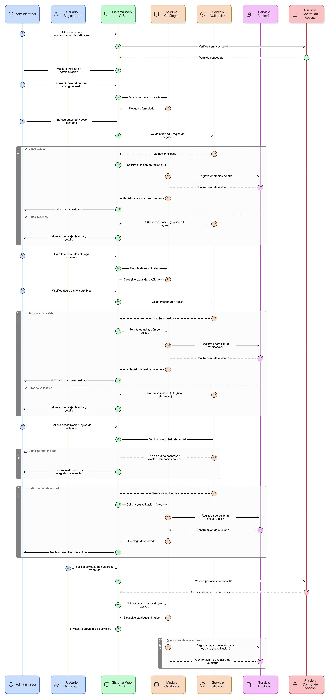

# Épica 003: Administración de Entidades Base del Módulo de Restauración

## 1. Descripción general

Esta épica tiene como objetivo habilitar la **administración centralizada, genérica y parametrizable de las entidades base** que soportan el funcionamiento del Módulo de Restauración del SNIF. Estas entidades incluyen catálogos maestros, combinaciones de reglas de negocio y entidades de soporte para reportes y contenidos de apropiación, y constituyen el **núcleo de configuración funcional del sistema**.

La épica define una **única funcionalidad de Administración de Entidades Base**, desde la cual el Administrador IDEAM puede seleccionar la entidad a gestionar y ejecutar operaciones controladas de creación, edición, activación e inactivación lógica, sin requerir interfaces específicas por cada tabla. Este enfoque garantiza **escalabilidad, mantenibilidad y consistencia** en la gestión del dato.

Las entidades base administradas gobiernan de manera transversal el comportamiento del sistema, incluyendo **formularios, validaciones, filtros, combinaciones permitidas, reportes públicos y contenidos de apropiación**, asegurando una operación coherente y alineada con los lineamientos institucionales.

Como capacidades transversales, la épica incorpora **mecanismos de auditoría, control de acceso por rol, validaciones de unicidad e integridad referencial**, permitiendo trazabilidad completa de los cambios, fortalecimiento de la gobernanza institucional del dato e integración segura con los procesos de Gestión y el Visor Geográfico.

Las funcionalidades están diseñadas para integrarse de forma coherente con un **aplicativo web GIS**, proporcionando una experiencia administrativa clara, controlada y consistente, orientada a la calidad del dato y a la evolución futura del módulo sin reprocesos estructurales.

---

## 2. Objetivo

Permitir al **Administrador IDEAM** administrar de forma **centralizada, genérica y parametrizable** las tablas y entidades base del Módulo de Restauración del SNIF, incluyendo catálogos maestros, combinaciones de reglas de negocio y entidades de soporte para reportes y contenidos de apropiación, garantizando la **gobernanza institucional del dato**, la **integridad referencial con los procesos de Gestión y el Visor Geográfico**, la **trazabilidad completa de los cambios**, el **control de acceso por rol** y la **escalabilidad del sistema sin la creación de interfaces específicas por cada entidad**.

---

## 3. Principio clave de diseño

La administración de entidades base del Módulo de Restauración **no se implementa mediante una pantalla independiente por cada tabla**.

El sistema dispone de una **única funcionalidad de “Administración de Entidades Base”**, desde la cual:

- Se selecciona la entidad o tabla a administrar.
- Se visualizan los campos, tipos de dato, reglas aplicables y estado de cada entidad.
- Se listan los registros existentes con opciones de búsqueda y filtrado.
- Se ejecutan operaciones CRUD controladas por rol.
- Se validan dependencias antes de permitir la inactivación de registros.

Este principio garantiza una solución **escalable, consistente y alineada con la gobernanza del dato**, reduciendo la complejidad técnica y funcional del sistema.

---

## 4. Historias de usuario asociadas

- [**HU-IDEAM-SNIF-REST-020:** Administración genérica de entidades base](/historias_usuario/EP-IDEAM-SNIF-REST-003/HU-IDEAM-SNIF-REST-020.md)
- [**HU-IDEAM-SNIF-REST-021:** CRUD de Tipo de Trámite](/historias_usuario/EP-IDEAM-SNIF-REST-003/HU-IDEAM-SNIF-REST-021.md)
- [**HU-IDEAM-SNIF-REST-022:** CRUD de Tipo de Acto Administrativo](/historias_usuario/EP-IDEAM-SNIF-REST-003/HU-IDEAM-SNIF-REST-022.md)
- [**HU-IDEAM-SNIF-REST-023:** CRUD de Fuentes de Financiación (Catálogo)](/historias_usuario/EP-IDEAM-SNIF-REST-003/HU-IDEAM-SNIF-REST-023.md)
- [**HU-IDEAM-SNIF-REST-024:** Administración de combinaciones Proyecto–Trámite–Acto](/historias_usuario/EP-IDEAM-SNIF-REST-003/HU-IDEAM-SNIF-REST-024.md)
- [**HU-IDEAM-SNIF-REST-025:** Auditoría de cambios en tablas de entidades base del proyecto](/historias_usuario/EP-IDEAM-SNIF-REST-003/HU-IDEAM-SNIF-REST-025.md)
- [**HU-IDEAM-SNIF-REST-026:** Control de acceso por rol en tablas de entidades base del proyecto](/historias_usuario/EP-IDEAM-SNIF-REST-003/HU-IDEAM-SNIF-REST-026.md)
- [**HU-IDEAM-SNIF-REST-027:** Validación de unicidad en tablas de entidades base del proyecto](/historias_usuario/EP-IDEAM-SNIF-REST-003/HU-IDEAM-SNIF-REST-027.md)
- [**HU-IDEAM-SNIF-REST-028:** Administración de entidades base para Apropiación (Reportes y Contenidos)](/historias_usuario/EP-IDEAM-SNIF-REST-003/HU-IDEAM-SNIF-REST-028.md)

---

## 5. Riesgos

- Complejidad en la configuración y parametrización de una interfaz genérica de administración.
- Riesgo de errores de configuración que afecten reglas de negocio, validaciones o formularios dependientes.
- Afectación a la integridad referencial por cambios inadecuados en entidades base críticas.
- Sobrecarga operativa del rol Administrador IDEAM al concentrar la gestión de todas las entidades.
- Duplicidad semántica o degradación de la calidad del dato por mala parametrización.
- Dependencia crítica de esta épica para la correcta operación de las demás épicas del módulo de restauración.
- Riesgos de desempeño asociados a validaciones dinámicas, auditoría transversal y escalabilidad futura.
- Necesidad de ajustes ante cambios normativos, institucionales o de estrategia de publicación de información.

---

## 5. Diagrama de secuencia

---

## 6. Wireframes / mockups
