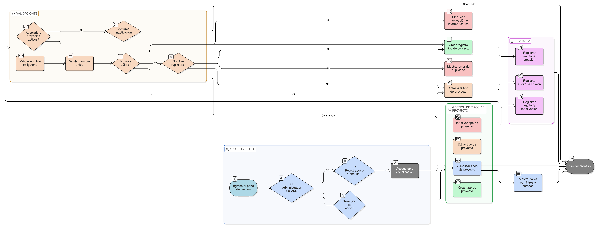

# HU-IDEAM-SNIF-REST-020

> **Identificador Historia de Usuario:** hu-ideam-snif-rest-020\
> **Nombre Historia de Usuario:** Administración genérica de entidades base

> **Sistema de información:** Sistema Nacional de Información Forestal\
> **Módulo / subsistema:** Módulo de restauración\
> **Validador temático(s):** Raymond Alexander Jiménez Arteaga

## DESCRIPCIÓN HISTORIA DE USUARIO

> **Como:** Administrador IDEAM.\
> **Quiero:** administrar desde una única interfaz las tablas y entidades base del sistema.\
> **Para:** mantener la consistencia, calidad y gobernanza del dato sin crear pantallas específicas por cada entidad.

## ALCANCE FUNCIONAL

- Selección de la entidad o tabla a administrar, entre las entidades base configuradas del módulo, tales como:
  - Tipo de Proyecto  
  - Tipo de Trámite  
  - Tipo de Acto Administrativo  
  - Fuentes de Financiación  
  - Combinaciones Proyecto–Trámite–Acto  
  - Entidades de Reportes  
  - Entidades de Apropiación (videos y documentos)

- Visualización dinámica de la configuración de la entidad seleccionada, incluyendo:
  - Campos configurados
  - Tipo de dato
  - Reglas aplicables
  - Estado del registro

- Listado de registros de la entidad seleccionada con:
  - Búsqueda
  - Filtros
  - Indicador de estado (activo / inactivo)

- Operaciones permitidas sobre los registros:
  - Crear registro
  - Editar registro
  - Activar / inactivar registro (eliminación lógica)
  - Visualizar dependencias antes de permitir la inactivación

## CRITERIOS DE ACEPTACIÓN

1. **Selección de entidad**\
   1.1 El sistema permite al Administrador IDEAM seleccionar la entidad base que desea administrar desde un selector único.\
   1.2 El sistema carga dinámicamente la configuración y los registros de la entidad seleccionada.

2. **Gestión de registros**\
   2.1 El sistema permite crear registros para la entidad seleccionada conforme a sus reglas configuradas.\
   2.2 El sistema permite editar registros existentes de la entidad seleccionada.\
   2.3 El sistema permite activar e inactivar registros de forma lógica.\
   2.4 El sistema no permite la eliminación física de registros.

3. **Validaciones y reglas de negocio**\
   3.1 El sistema aplica las validaciones definidas para cada entidad base (obligatoriedad, unicidad, integridad referencial).\
   3.2 El sistema valida dependencias antes de permitir la inactivación de un registro.\
   3.3 El sistema informa al usuario cuando una operación no es permitida por reglas de negocio.

4. **Visualización y experiencia de usuario**\
   4.1 El sistema presenta un panel único de administración de entidades base.\
   4.2 El panel incluye un selector de entidad, una tabla dinámica de registros y acciones por fila.\
   4.3 El sistema solicita confirmación explícita antes de ejecutar acciones críticas.

5. **Control de acceso por rol**\
   5.1 Solo el rol Administrador IDEAM puede acceder a la funcionalidad de administración genérica de entidades base.\
   5.2 Los roles Registrador y Consulta no pueden acceder ni ejecutar acciones en esta funcionalidad.

6. **Auditoría**\
   6.1 El sistema registra todas las operaciones realizadas sobre las entidades base administradas desde esta funcionalidad.

## ROLES

- **Administrador IDEAM**: Puede seleccionar entidades y realizar operaciones de creación, edición, activación e inactivación de registros.  
- **Registrador**: No puede acceder a la funcionalidad.  
- **Consulta**: No puede acceder a la funcionalidad.

## RESTRICCIONES Y LÍMITES

- La administración de entidades base se realiza exclusivamente a través de una interfaz genérica; no existen pantallas específicas por entidad.  
- No se permite la eliminación física de registros; solo se admite la activación o inactivación lógica.  
- Las reglas de validación y dependencias están determinadas por la configuración de cada entidad.  
- Solo el rol Administrador IDEAM puede acceder y operar esta funcionalidad.  
- Esta historia de usuario no contempla la creación ni modificación de la estructura técnica de las tablas (campos, tipos de dato).

## DIAGRAMA DE FLUJO DEL PROCESO

