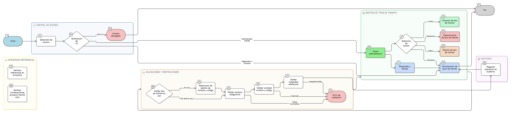

# HU-IDEAM-SNIF-REST-021

> **Identificador Historia de Usuario:** hu-ideam-snif-rest-021\
> **Nombre Historia de Usuario:** CRUD de Tipo de Trámite

> **Sistema de información:** Sistema Nacional de Información Forestal\
> **Módulo / subsistema:** Módulo de restauración\
> **Validador temático(s):** Raymond Alexander Jiménez Arteaga

## DESCRIPCIÓN HISTORIA DE USUARIO

> **Como:** Administrador IDEAM.\
> **Quiero:** gestionar los tipos de trámite desde la funcionalidad genérica de administración de entidades base.\
> **Para:** definir y controlar los procesos administrativos asociados a los proyectos de restauración.

## ALCANCE FUNCIONAL

- Gestión del catálogo **Tipo de Trámite** desde la interfaz genérica de administración de entidades base.
- Visualización y administración de los siguientes atributos del tipo de trámite:
  - Nombre
  - Código interno (opcional)
  - Descripción
  - Estado (activo / inactivo)

- Uso del tipo de trámite en:
  - Formulario de registro y edición de proyectos.
  - Combinaciones Proyecto–Trámite–Acto Administrativo.

## CRITERIOS DE ACEPTACIÓN

1. **Creación y edición**\
   1.1 El sistema permite crear un tipo de trámite con un nombre válido y un estado definido.\
   1.2 El sistema permite registrar un código interno opcional asociado al tipo de trámite.\
   1.3 El sistema permite editar la descripción y el estado de un tipo de trámite existente.\
   1.4 Cuando el tipo de trámite se encuentra en uso, el sistema restringe la edición del nombre y del código interno, permitiendo únicamente modificar la descripción o el estado.

2. **Validaciones del dato**\
   2.1 El campo nombre es obligatorio para la creación y edición del tipo de trámite.\
   2.2 El campo estado es obligatorio para el registro del tipo de trámite.\
   2.3 No se permite registrar ni editar un tipo de trámite con una combinación duplicada de nombre y código interno.

3. **Integridad referencial**\
   3.1 El sistema valida la integridad referencial del tipo de trámite con el formulario de proyectos y las combinaciones Proyecto–Trámite–Acto Administrativo.\
   3.2 El sistema bloquea la modificación del nombre y código interno cuando el tipo de trámite se encuentra en uso.

4. **Visualización y experiencia de usuario**\
   4.1 El tipo de trámite se administra desde la tabla dinámica de la funcionalidad genérica de entidades base.\
   4.2 El sistema presenta indicadores visuales del estado del registro (activo / inactivo).

5. **Control de acceso por rol**\
   5.1 Solo el rol Administrador IDEAM puede crear, editar o inactivar tipos de trámite.\
   5.2 Los roles Registrador y Consulta solo pueden visualizar y seleccionar tipos de trámite activos desde los formularios del sistema.

6. **Auditoría**\
   6.1 El sistema registra todas las operaciones realizadas sobre el catálogo de tipos de trámite.

## ROLES

- **Administrador IDEAM**: Puede crear, editar y administrar los tipos de trámite desde la interfaz genérica de entidades base.  
- **Registrador**: Accede a los tipos de trámite activos desde el formulario de proyecto.  
- **Consulta**: Accede a los tipos de trámite activos desde la visualización del registro.

## RESTRICCIONES Y LÍMITES

- Los tipos de trámite se administran exclusivamente desde la funcionalidad genérica de entidades base.  
- No se permite la eliminación física de tipos de trámite; únicamente se admite la inactivación lógica.  
- No se permite modificar el nombre ni el código interno de un tipo de trámite que ya se encuentre en uso.  
- La combinación nombre + código interno debe ser única.  
- Los tipos de trámite inactivos no deben estar disponibles para su selección en el formulario de proyectos.

## DIAGRAMA DE FLUJO DEL PROCESO

