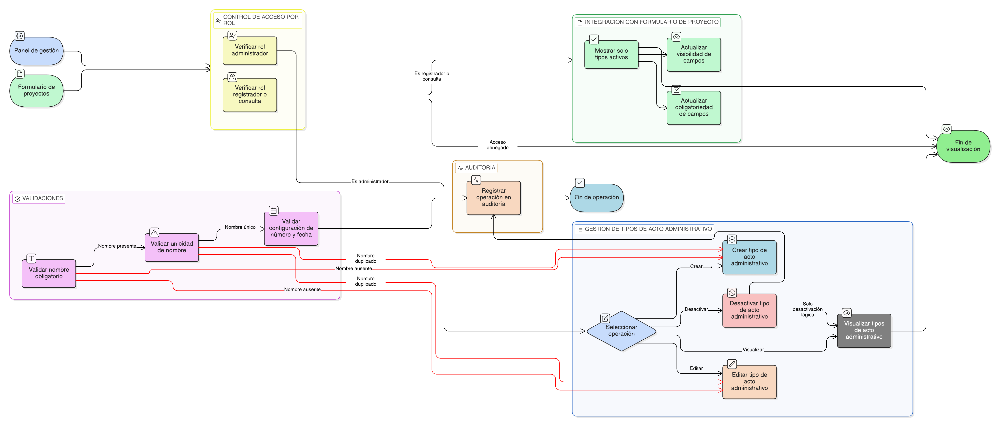

# HU-IDEAM-SNIF-REST-022

> **Identificador Historia de Usuario:** hu-ideam-snif-rest-022\
> **Nombre Historia de Usuario:** CRUD de Tipo de Acto Administrativo

> **Sistema de información:** Sistema Nacional de Información Forestal\
> **Módulo / subsistema:** Módulo de restauración\
> **Validador temático(s):** Raymond Alexander Jiménez Arteaga

## DESCRIPCIÓN HISTORIA DE USUARIO

> **Como:** Administrador IDEAM.\
> **Quiero:** gestionar los tipos de actos administrativos desde la funcionalidad genérica de administración de entidades base.\
> **Para:** estandarizar la información normativa asociada a los proyectos de restauración.

## ALCANCE FUNCIONAL

- Gestión del catálogo **Tipo de Acto Administrativo** desde la interfaz genérica de administración de entidades base.
- Visualización y administración de los siguientes atributos:
  - Nombre
  - Requiere número de acto (Sí / No)
  - Requiere fecha de acto (Sí / No)
  - Descripción
  - Estado (activo / inactivo)

- Uso del tipo de acto administrativo en:
  - Formulario de registro y edición de proyectos.
  - Definición dinámica de campos visibles y obligatorios.

## CRITERIOS DE ACEPTACIÓN

1. **Creación y edición**\
   1.1 El sistema permite crear un tipo de acto administrativo con un nombre válido y único.\
   1.2 El sistema permite configurar si el tipo de acto administrativo requiere número de acto.\
   1.3 El sistema permite configurar si el tipo de acto administrativo requiere fecha de acto.\
   1.4 El sistema permite editar el nombre, la descripción y las configuraciones de obligatoriedad, siempre que se cumplan las validaciones definidas.

2. **Validaciones del dato**\
   2.1 El campo nombre es obligatorio para la creación y edición del tipo de acto administrativo.\
   2.2 No se permite registrar ni editar un tipo de acto administrativo con un nombre duplicado.

3. **Integración con formularios y reglas de negocio**\
   3.1 El sistema controla dinámicamente la visibilidad de los campos número de acto y fecha de acto en el formulario del proyecto según la configuración del tipo de acto administrativo.\
   3.2 El sistema controla la obligatoriedad de los campos número de acto y fecha de acto de acuerdo con la configuración definida.

4. **Visualización y experiencia de usuario**\
   4.1 El tipo de acto administrativo se administra desde la tabla dinámica de la funcionalidad genérica de entidades base.\
   4.2 El sistema presenta indicadores visuales del estado del registro (activo / inactivo).

5. **Control de acceso por rol**\
   5.1 Solo el rol Administrador IDEAM puede crear, editar o inactivar tipos de actos administrativos.\
   5.2 Los roles Registrador y Consulta solo pueden visualizar y seleccionar tipos de actos administrativos activos desde los formularios del sistema.

6. **Auditoría**\
   6.1 El sistema registra todas las operaciones realizadas sobre el catálogo de tipos de actos administrativos.

## ROLES

- **Administrador IDEAM**: Puede crear, editar y administrar los tipos de actos administrativos desde la interfaz genérica de entidades base.  
- **Registrador**: Accede a los tipos de actos administrativos activos desde el formulario de proyecto.  
- **Consulta**: Accede a los tipos de actos administrativos activos desde la visualización del registro.

## RESTRICCIONES Y LÍMITES

- Los tipos de actos administrativos se administran exclusivamente desde la funcionalidad genérica de entidades base.  
- No se permite la eliminación física de tipos de actos administrativos; únicamente se admite la inactivación lógica.  
- El nombre del tipo de acto administrativo debe ser único.  
- La configuración de obligatoriedad de número y fecha de acto gobierna el comportamiento del formulario de proyectos.  
- Los tipos de actos administrativos inactivos no deben estar disponibles para su selección en el formulario de proyectos.

## DIAGRAMA DE FLUJO DEL PROCESO

