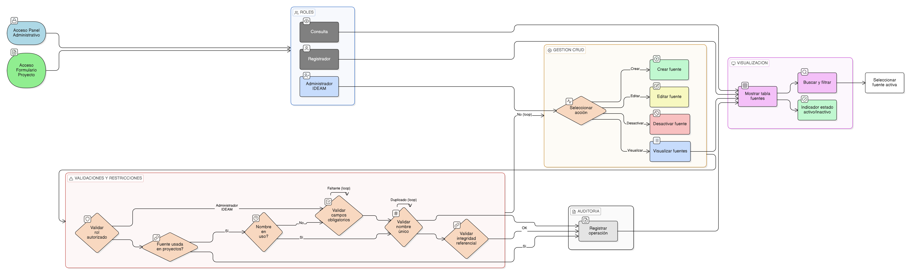

# HU-IDEAM-SNIF-REST-023

> **Identificador Historia de Usuario:** hu-ideam-snif-rest-023\
> **Nombre Historia de Usuario:** CRUD de Fuentes de Financiación (Catálogo)

> **Sistema de información:** Sistema Nacional de Información Forestal\
> **Módulo / subsistema:** Módulo de restauración\
> **Validador temático(s):** Raymond Alexander Jiménez Arteaga

## DESCRIPCIÓN HISTORIA DE USUARIO

> **Como:** Administrador IDEAM.\
> **Quiero:** gestionar las fuentes de financiación desde la funcionalidad genérica de administración de entidades base.\
> **Para:** asociarlas correctamente a los proyectos de restauración.

## ALCANCE FUNCIONAL

- Gestión del catálogo **Fuentes de Financiación** desde la interfaz genérica de administración de entidades base.
- Visualización y administración de los siguientes atributos:
  - Nombre
  - Tipo de fuente (pública, privada, cooperación)
  - Descripción
  - Estado (activo / inactivo)

- Uso de la fuente de financiación en:
  - Gestión financiera del proyecto.
  - Asociación proyecto–financiación (definida en [EP-IDEAM-SNIF-REST-005](/historias_usuario/EP-IDEAM-SNIF-REST-005.md)).

## CRITERIOS DE ACEPTACIÓN

1. **Creación y edición**\
   1.1 El sistema permite crear una fuente de financiación con un nombre válido y único.\
   1.2 El sistema permite seleccionar el tipo de fuente de financiación (pública, privada o cooperación).\
   1.3 El sistema permite editar el tipo y el estado de una fuente de financiación existente.\
   1.4 Cuando la fuente de financiación se encuentra en uso, el sistema restringe la edición del nombre.

2. **Validaciones del dato**\
   2.1 El campo nombre es obligatorio para la creación y edición de la fuente de financiación.\
   2.2 El campo tipo de fuente es obligatorio para el registro de la fuente de financiación.\
   2.3 No se permite registrar ni editar una fuente de financiación con un nombre duplicado.

3. **Integridad referencial**\
   3.1 El sistema valida la integridad referencial de la fuente de financiación con los proyectos que la utilizan.\
   3.2 No se permite eliminar ni modificar el nombre de una fuente de financiación que ya haya sido utilizada en proyectos.\
   3.3 La inactivación de una fuente de financiación no afecta los proyectos ya registrados que la referencian.

4. **Visualización y experiencia de usuario**\
   4.1 La fuente de financiación se administra desde la tabla dinámica de la funcionalidad genérica de entidades base.\
   4.2 El sistema presenta indicadores visuales del estado del registro (activo / inactivo).

5. **Control de acceso por rol**\
   5.1 Solo el rol Administrador IDEAM puede crear, editar o inactivar fuentes de financiación.\
   5.2 Los roles Registrador y Consulta solo pueden visualizar y seleccionar fuentes de financiación activas desde los formularios del sistema.

6. **Auditoría**\
   6.1 El sistema registra todas las operaciones realizadas sobre el catálogo de fuentes de financiación.

## ROLES

- **Administrador IDEAM**: Puede crear, editar y administrar las fuentes de financiación desde la interfaz genérica de entidades base.  
- **Registrador**: Accede a las fuentes de financiación activas desde el formulario de proyecto.  
- **Consulta**: Accede a las fuentes de financiación activas desde la visualización del registro correspondiente al proyecto.

## RESTRICCIONES Y LÍMITES

- Las fuentes de financiación se administran exclusivamente desde la funcionalidad genérica de entidades base.  
- Las fuentes de financiación no pueden eliminarse físicamente; únicamente se permite la inactivación lógica.  
- El nombre de la fuente de financiación debe ser único.  
- No se permite modificar el nombre de una fuente de financiación que ya haya sido utilizada en proyectos.  
- Las fuentes de financiación inactivas no deben estar disponibles para su selección en los formularios del sistema.

## DIAGRAMA DE FLUJO DEL PROCESO

