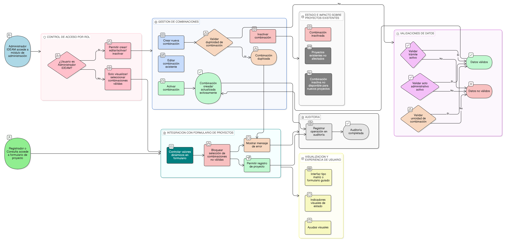

# HU-IDEAM-SNIF-REST-024

> **Identificador Historia de Usuario:** hu-ideam-snif-rest-024\
> **Nombre Historia de Usuario:** Administración de combinaciones Proyecto–Trámite–Acto

> **Sistema de información:** Sistema Nacional de Información Forestal\
> **Módulo / subsistema:** Módulo de restauración\
> **Validador temático(s):** Raymond Alexander Jiménez Arteaga

## DESCRIPCIÓN HISTORIA DE USUARIO

> **Como:** Administrador IDEAM.\
> **Quiero:** definir y administrar combinaciones válidas entre tipo de proyecto, trámite y acto administrativo desde la funcionalidad genérica de entidades base.\
> **Para:** controlar las reglas de negocio y los requisitos aplicables a los proyectos de restauración.

## ALCANCE FUNCIONAL

- Gestión de la entidad **Combinaciones Proyecto–Trámite–Acto** desde la interfaz genérica de administración de entidades base.
- Visualización y administración de las relaciones entre:
  - Tipo de proyecto
  - Tipo de trámite
  - Tipo de acto administrativo

- Gobierno dinámico del comportamiento del formulario de proyectos:
  - Valores permitidos
  - Validaciones en tiempo real
  - Reglas antes del guardado

## CRITERIOS DE ACEPTACIÓN

1. **Gestión de combinaciones**\
   1.1 El sistema permite crear combinaciones válidas entre tipo de proyecto, tipo de trámite y tipo de acto administrativo.\
   1.2 El sistema permite activar e inactivar combinaciones existentes.\
   1.3 El sistema impide la creación de combinaciones duplicadas entre tipo de proyecto, trámite y acto administrativo.

2. **Validaciones del dato**\
   2.1 Solo se pueden seleccionar tipos de trámite y tipos de acto administrativo activos.\
   2.2 La combinación tipo de proyecto + tipo de trámite + tipo de acto administrativo debe ser única.\
   2.3 El sistema valida las combinaciones en tiempo real y antes del guardado del proyecto.

3. **Integración con el formulario de proyectos**\
   3.1 El sistema controla dinámicamente los valores disponibles en el formulario del proyecto según las combinaciones configuradas.\
   3.2 El sistema bloquea la selección de combinaciones no válidas desde el formulario del proyecto.\
   3.3 El sistema presenta mensajes claros cuando una combinación no está permitida.

4. **Estado e impacto sobre proyectos existentes**\
   4.1 La inactivación de una combinación no afecta los proyectos ya registrados que la utilizan.\
   4.2 Las combinaciones inactivas no deben estar disponibles para nuevos registros de proyectos.

5. **Visualización y experiencia de usuario**\
   5.1 Las combinaciones se administran desde la tabla dinámica de la funcionalidad genérica de entidades base.\
   5.2 El sistema presenta indicadores visuales del estado de las combinaciones (activo / inactivo).

6. **Control de acceso por rol**\
   6.1 Solo el rol Administrador IDEAM puede crear, editar, activar o inactivar combinaciones Proyecto–Trámite–Acto.\
   6.2 Los roles Registrador y Consulta interactúan con las combinaciones únicamente a través del formulario y la visualización de proyectos.

7. **Auditoría**\
   7.1 El sistema registra todas las operaciones realizadas sobre las combinaciones Proyecto–Trámite–Acto.

## ROLES

- **Administrador IDEAM**: Puede crear, editar y administrar las combinaciones Proyecto–Trámite–Acto desde la interfaz genérica de entidades base.  
- **Registrador**: Utiliza las combinaciones disponibles desde el formulario de proyecto.  
- **Consulta**: Visualiza la información asociada a las combinaciones desde la consulta de proyectos.

## RESTRICCIONES Y LÍMITES

- Las combinaciones Proyecto–Trámite–Acto se administran exclusivamente desde la funcionalidad genérica de entidades base.  
- No se permite la eliminación física de combinaciones; únicamente se admite la activación o inactivación lógica.  
- No se permite duplicar la combinación tipo de proyecto + tipo de trámite + tipo de acto administrativo.  
- Las combinaciones inactivas no deben estar disponibles para nuevos registros de proyectos.  
- La inactivación de una combinación no modifica ni invalida proyectos ya registrados en el sistema.

## DIAGRAMA DE FLUJO DEL PROCESO

