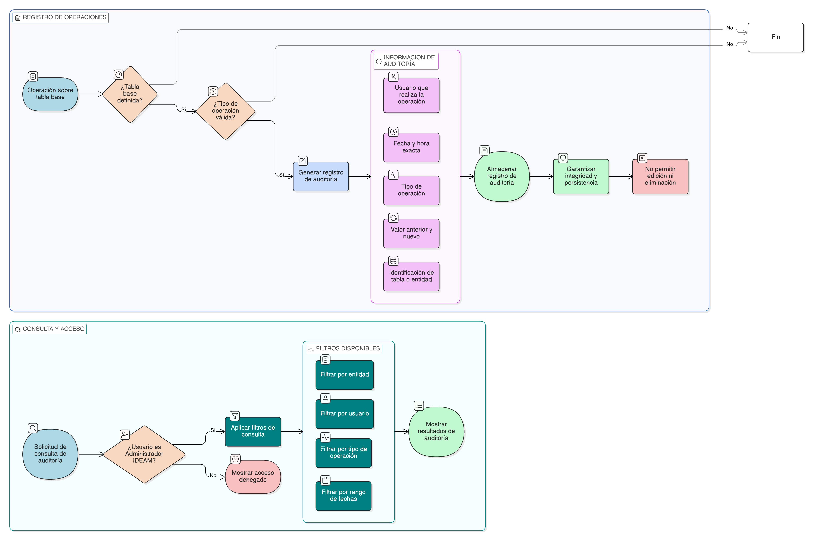

# HU-IDEAM-SNIF-REST-025

> **Identificador Historia de Usuario:** hu-ideam-snif-rest-025\
> **Nombre Historia de Usuario:** Auditoría de cambios en tablas de entidades base del proyecto

> **Sistema de información:** Sistema Nacional de Información Forestal\
> **Módulo / subsistema:** Módulo de restauración\
> **Validador temático(s):** Raymond Alexander Jiménez Arteaga

## DESCRIPCIÓN HISTORIA DE USUARIO

> **Como:** Administrador IDEAM.\
> **Quiero:** registrar y consultar todas las operaciones realizadas sobre las tablas de entidades base del proyecto.\
> **Para:** garantizar la trazabilidad completa de los cambios, el control institucional y la gobernanza del dato.

## ALCANCE FUNCIONAL

- Auditoría transversal sobre todas las entidades administradas desde la funcionalidad genérica de entidades base.
- Registro automático de las operaciones realizadas sobre los datos, sin intervención del usuario.
- Consulta de registros de auditoría desde una vista controlada por rol.

## CRITERIOS DE ACEPTACIÓN

1. **Registro de auditoría**\
   1.1 El sistema registra todas las operaciones realizadas sobre las entidades base del proyecto.\
   1.2 Las operaciones auditadas incluyen creación, edición, activación e inactivación de registros.\
   1.3 El registro de auditoría se genera automáticamente al ejecutar una operación válida.

2. **Información auditada**\
   2.1 Cada registro de auditoría incluye el usuario que realizó la operación.\
   2.2 Cada registro de auditoría incluye la fecha y hora exacta de la operación.\
   2.3 Cada registro de auditoría incluye el tipo de operación realizada.\
   2.4 Cada registro de auditoría incluye el valor anterior y el nuevo valor del registro afectado.\
   2.5 Cada registro de auditoría identifica la entidad o tabla afectada.

3. **Consulta de auditoría**\
   3.1 El sistema permite al Administrador IDEAM consultar los registros de auditoría.\
   3.2 El sistema permite filtrar los registros por entidad, usuario, tipo de operación y rango de fechas.

4. **Integridad y seguridad del registro**\
   4.1 Los registros de auditoría no pueden ser editados ni eliminados por ningún usuario.\
   4.2 El sistema garantiza la persistencia e integridad de la información auditada.

5. **Control de acceso por rol**\
   5.1 Solo el rol Administrador IDEAM puede acceder a la consulta de auditoría.\
   5.2 Los roles Registrador y Consulta no tienen acceso a los registros de auditoría.

## ROLES

- **Administrador IDEAM**: Puede visualizar y consultar los registros de auditoría.  
- **Registrador**: No tiene acceso a la información de auditoría.  
- **Consulta**: No tiene acceso a la información de auditoría.

## RESTRICCIONES Y LÍMITES

- La auditoría aplica únicamente a las entidades base administradas desde la funcionalidad genérica del módulo.  
- Los registros de auditoría no pueden ser modificados ni eliminados.  
- La auditoría no permite la reversión automática de cambios sobre los datos auditados.  
- El acceso a la información de auditoría está restringido exclusivamente al rol Administrador IDEAM.  
- Esta historia de usuario no contempla la exportación masiva ni la edición de registros de auditoría.

## DIAGRAMA DE FLUJO DEL PROCESO

