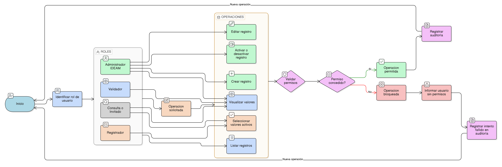

# HU-IDEAM-SNIF-REST-026

> **Identificador Historia de Usuario:** hu-ideam-snif-rest-026\
> **Nombre Historia de Usuario:** Control de acceso por rol en tablas de entidades base del proyecto

> **Sistema de información:** Sistema Nacional de Información Forestal\
> **Módulo / subsistema:** Módulo de restauración\
> **Validador temático(s):** Raymond Alexander Jiménez Arteaga

## DESCRIPCIÓN HISTORIA DE USUARIO

> **Como:** sistema.\
> **Quiero:** restringir las operaciones CRUD sobre las tablas de entidades base del proyecto según el rol del usuario.\
> **Para:** garantizar la seguridad, la gobernanza del dato y el cumplimiento de los lineamientos institucionales.

## ALCANCE FUNCIONAL

- Aplicación de control de acceso por rol sobre todas las entidades administradas desde la funcionalidad genérica de entidades base.
- Restricción de operaciones de listado, creación, edición y activación/inactivación según el rol del usuario.
- Validación de permisos tanto en la interfaz de usuario como en el backend.

## CRITERIOS DE ACEPTACIÓN

1. **Aplicación del control de acceso**\
   1.1 El sistema aplica control de acceso por rol a todas las operaciones disponibles en la administración genérica de entidades base.\
   1.2 El control de acceso se aplica de manera transversal e independiente del tipo de entidad seleccionada.

2. **Permisos por rol**\
   2.1 El rol Administrador IDEAM puede listar entidades, listar registros, crear, editar y activar o inactivar registros.\
   2.2 El rol Registrador no puede listar entidades ni registros, ni ejecutar operaciones sobre las entidades base.\
   2.3 El rol Consulta / Invitado no puede listar entidades ni registros, ni ejecutar operaciones sobre las entidades base.

3. **Restricción de operaciones no autorizadas**\
   3.1 El sistema bloquea cualquier intento de ejecución de una operación no autorizada según el rol del usuario.\
   3.2 El sistema informa al usuario cuando no cuenta con permisos para realizar la acción solicitada.

4. **Seguridad e integración técnica**\
   4.1 El control de acceso se valida tanto en frontend como en backend.\
   4.2 El sistema previene accesos directos a operaciones restringidas mediante validaciones de seguridad.

5. **Auditoría de operaciones**\
   5.1 Las operaciones exitosas ejecutadas sobre las entidades base se registran para efectos de auditoría.

## ROLES

- **Administrador IDEAM**: Puede realizar todas las operaciones de administración sobre las entidades base del proyecto.  
- **Registrador**: No tiene acceso a la funcionalidad de administración de entidades base.  
- **Consulta / Invitado**: No tiene acceso a la funcionalidad de administración de entidades base.

## RESTRICCIONES Y LÍMITES

- Las operaciones permitidas están estrictamente definidas por el rol del usuario.  
- Ningún rol distinto al Administrador IDEAM puede crear, editar, activar o inactivar registros en las entidades base.  
- El control de acceso debe aplicarse obligatoriamente en frontend y backend.  
- Esta historia de usuario no contempla la administración ni configuración de roles o permisos.  
- Los permisos definidos no pueden ser modificados desde la interfaz de usuario.

## DIAGRAMA DE FLUJO DEL PROCESO

