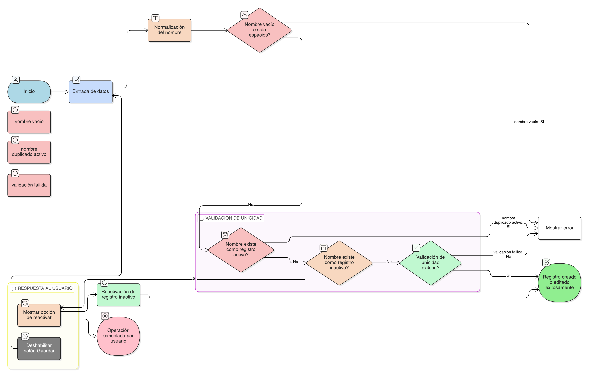

# HU-IDEAM-SNIF-REST-027

> **Identificador Historia de Usuario:** hu-ideam-snif-rest-027\
> **Nombre Historia de Usuario:** Validación de unicidad en tablas de entidades base del proyecto

> **Sistema de información:** Sistema Nacional de Información Forestal\
> **Módulo / subsistema:** Módulo de restauración\
> **Validador temático(s):** Raymond Alexander Jiménez Arteaga

## DESCRIPCIÓN HISTORIA DE USUARIO

> **Como:** sistema.\
> **Quiero:** garantizar la unicidad de los valores registrados en las tablas de entidades base del proyecto.\
> **Para:** evitar ambigüedades, duplicidades semánticas y errores en la selección de valores dentro del módulo de restauración del SNIF.

## ALCANCE FUNCIONAL

- Aplicación de reglas de unicidad sobre todas las entidades administradas desde la funcionalidad genérica de entidades base.
- Validación de unicidad por entidad de forma independiente.
- Soporte para reactivación de registros inactivos cuando corresponda.

## CRITERIOS DE ACEPTACIÓN

1. **Unicidad por nombre**\
   1.1 El sistema valida que no existan dos registros con el mismo nombre dentro de la misma entidad base.\
   1.2 La validación de unicidad se realiza de forma independiente para cada entidad administrada.

2. **Unicidad sobre registros activos**\
   2.1 No pueden existir dos registros activos con el mismo nombre dentro de una misma entidad.\
   2.2 Cuando existe un registro inactivo con el mismo nombre, el sistema informa al usuario y ofrece la opción de reactivarlo.

3. **Normalización del nombre**\
   3.1 El sistema normaliza el texto del nombre antes de ejecutar la validación de unicidad.\
   3.2 La normalización incluye:
       - Eliminación de espacios al inicio y al final.  
       - Eliminación de espacios dobles.  
       - Conversión a minúsculas para la comparación.

4. **Validación en creación y edición**\
   4.1 La validación de unicidad se aplica tanto en la creación como en la edición de registros.\
   4.2 El sistema bloquea la creación o edición de un registro cuando la validación de unicidad falla.

5. **Experiencia de usuario**\
   5.1 El sistema ejecuta la validación de unicidad en tiempo real al perder foco del campo nombre.\
   5.2 El sistema muestra mensajes claros cuando el nombre ingresado ya existe. **"Ya existe un valor activo con este nombre. Puede reactivarlo o modificar el existente."**\
   5.3 El botón Guardar se deshabilita mientras la validación de unicidad no sea satisfactoria.\
   5.4 Cuando existe un registro inactivo con el mismo nombre, el sistema muestra la opción de **“Reactivar registro existente”**.

6. **Aplicación transversal**\
   6.1 La validación de unicidad se aplica automáticamente para todas las entidades base administradas desde la funcionalidad genérica.\
   6.2 La validación no depende del rol del usuario.

## ROLES

- **Administrador IDEAM**: A través de las validaciones del sistema, garantiza la unicidad de los valores registrados en las entidades base.  
- **Registrador**: Visualiza los datos ya validados desde los formularios del sistema.  
- **Consulta / Invitado**: Visualiza los datos ya validados desde las opciones de consulta.

## RESTRICCIONES Y LÍMITES

- No se permite registrar valores con nombre vacío o compuesto únicamente por espacios.  
- No se permite registrar ni editar valores con nombres duplicados o semánticamente equivalentes tras la normalización.  
- No se permite crear un nuevo registro cuando existe uno inactivo con el mismo nombre; únicamente se permite su reactivación.  
- La validación de unicidad es obligatoria y no puede ser deshabilitada por el usuario.  
- Esta historia de usuario no contempla la detección automática de equivalencias semánticas avanzadas.

## DIAGRAMA DE FLUJO DEL PROCESO

