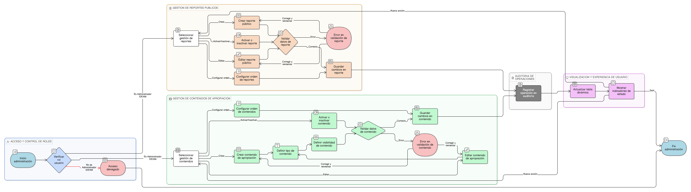

# HU-IDEAM-SNIF-REST-028

> **Identificador Historia de Usuario:** hu-ideam-snif-rest-028\
> **Nombre Historia de Usuario:** Administración de entidades base para Apropiación (Reportes y Contenidos)

> **Sistema de información:** Sistema Nacional de Información Forestal\
> **Módulo / subsistema:** Módulo de restauración\
> **Validador temático(s):** Raymond Alexander Jiménez Arteaga

## DESCRIPCIÓN HISTORIA DE USUARIO

> **Como:** Administrador IDEAM.\
> **Quiero:** administrar las entidades base de reportes y contenidos de apropiación.\
> **Para:** controlar qué información se publica en el sistema y cómo se presenta a los usuarios.

## ALCANCE FUNCIONAL

- Gestión de las entidades base de **Apropiación**, incluyendo:
  - **Reportes públicos**
  - **Contenidos de apropiación** (videos y documentos)

- Administración de reportes públicos con los siguientes atributos:
  - Nombre
  - Descripción
  - URL o endpoint
  - Estado (activo / inactivo)

- Administración de contenidos de apropiación con los siguientes atributos:
  - Tipo de contenido (video / documento)
  - Título
  - Descripción
  - Enlace o archivo
  - Visibilidad (público / interno)
  - Estado (activo / inactivo)

- Configuración del orden de visualización de reportes y contenidos en el frontend.

## CRITERIOS DE ACEPTACIÓN

1. **Gestión de reportes públicos**\
   1.1 El sistema permite crear, editar y activar o inactivar reportes públicos.\
   1.2 Solo los reportes en estado activo se visualizan en el frontend.\
   1.3 El sistema permite configurar el orden de visualización de los reportes.

2. **Gestión de contenidos de apropiación**\
   2.1 El sistema permite crear, editar y activar o inactivar contenidos de apropiación.\
   2.2 El sistema permite definir el tipo de contenido (video o documento).\
   2.3 El sistema permite definir la visibilidad del contenido (público o interno).\
   2.4 Solo los contenidos activos y marcados como públicos se visualizan en el frontend.\
   2.5 El sistema permite configurar el orden de visualización de los contenidos.

3. **Validaciones del dato**\
   3.1 El sistema valida la obligatoriedad de los campos definidos para cada tipo de entidad.\
   3.2 El sistema aplica validaciones de integridad y formato sobre enlaces y archivos.

4. **Visualización y experiencia de usuario**\
   4.1 Los reportes y contenidos se administran desde la tabla dinámica de la funcionalidad genérica de entidades base.\
   4.2 El sistema presenta indicadores visuales del estado de cada registro.

5. **Control de acceso por rol**\
   5.1 Solo el rol Administrador IDEAM puede crear, editar, activar o inactivar reportes y contenidos de apropiación.\
   5.2 Los roles Registrador y Consulta no pueden acceder a la administración de estas entidades.

6. **Auditoría**\
   6.1 El sistema registra todas las operaciones realizadas sobre las entidades base de Apropiación.

## ROLES

- **Administrador IDEAM**: Puede administrar reportes públicos y contenidos de apropiación desde la interfaz genérica de entidades base.  
- **Registrador**: No tiene acceso a la administración de reportes ni contenidos de apropiación.  
- **Consulta / Invitado**: No tiene acceso a la administración de reportes ni contenidos de apropiación.

## RESTRICCIONES Y LÍMITES

- La administración de reportes y contenidos de apropiación se realiza exclusivamente desde la funcionalidad genérica de entidades base.  
- No se permite la eliminación física de registros; únicamente se admite la activación o inactivación lógica.  
- Solo los registros activos y marcados como públicos se visualizan en el frontend.  
- El orden de visualización es configurable únicamente por el Administrador IDEAM.  
- Esta historia de usuario no contempla la creación de visualizaciones personalizadas en el frontend.

## DIAGRAMA DE FLUJO DEL PROCESO

