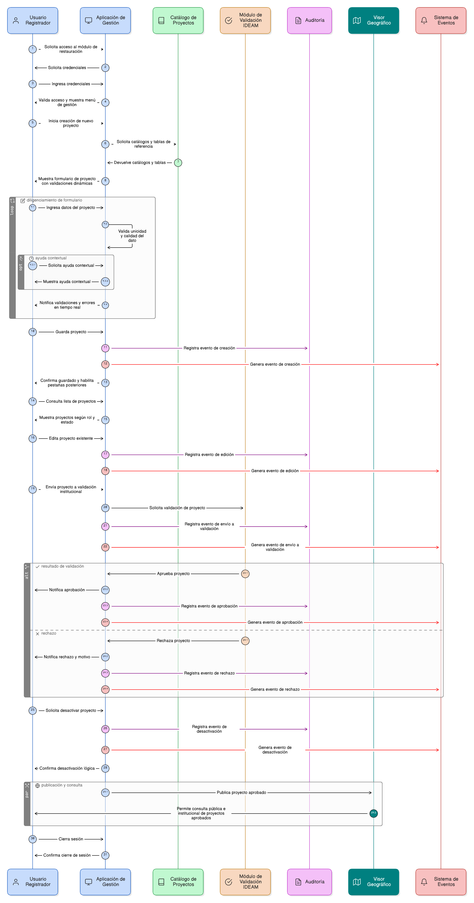

# Épica 004: Gestión Integral de Proyectos de Restauración

## 1. Descripción general

Esta épica tiene como objetivo habilitar la **gestión integral del ciclo de vida de los proyectos de restauración ecológica** dentro del SNIF, **exclusivamente desde la aplicación de Gestión**, desde su creación y edición inicial hasta su validación institucional, auditoría y desactivación lógica.

La épica contempla funcionalidades para la **creación, consulta, actualización, envío a validación, aprobación, rechazo y desactivación lógica de proyectos**, incorporando reglas estrictas de **calidad del dato, unicidad, control de estados, integridad referencial y control de acceso por rol**. Estas capacidades aseguran que los proyectos se gestionen de forma coherente, completa y alineada con los lineamientos institucionales del IDEAM.

Asimismo, la épica define de manera explícita el **flujo de validación institucional**, la generación de eventos del sistema y los mecanismos de **auditoría y trazabilidad**, garantizando transparencia, control y seguimiento de todas las operaciones realizadas sobre los proyectos.

El **Visor Geográfico** se utiliza exclusivamente como herramienta de **consulta pública e institucional**, permitiendo la visualización únicamente de proyectos en estado **APROBADO**, sin habilitar operaciones de creación, edición o validación.

Las funcionalidades de gestión están diseñadas bajo un enfoque de **aplicativo web GIS**, mediante formularios modales, navegación guiada, validaciones dinámicas y reglas de experiencia de usuario obligatorias, proporcionando una experiencia clara, controlada y orientada a la reducción de errores en el registro.

En conjunto, esta épica constituye el **núcleo operativo del módulo de restauración del SNIF**, apoyándose en los catálogos definidos en la Épica 003 y habilitando la correcta ejecución de los procesos de gestión, validación, seguimiento y publicación de proyectos.

---

## 2. Objetivo

Permitir la **creación, consulta, actualización, envío a validación, aprobación, rechazo y desactivación lógica de proyectos de restauración ecológica** en el SNIF **desde la aplicación de Gestión**, garantizando la calidad, completitud y unicidad del dato, la trazabilidad institucional, la integridad referencial con catálogos y tablas relacionales, el control de acceso por rol y una separación clara entre las funcionalidades de Gestión y Visor Geográfico.

---

## 3. Historias de usuario asociadas

### Control de acceso
- [**HU-IDEAM-SNIF-REST-029:** Control de acceso a la Gestión de Proyectos](EP-IDEAM-SNIF-REST-004/HU-IDEAM-SNIF-REST-029.md)

### Gestión del proyecto
- [**HU-IDEAM-SNIF-REST-030:** Crear un proyecto de restauración](EP-IDEAM-SNIF-REST-004/HU-IDEAM-SNIF-REST-030.md)
- [**HU-IDEAM-SNIF-REST-031:** Consultar y listar proyectos en Gestión](EP-IDEAM-SNIF-REST-004/HU-IDEAM-SNIF-REST-031.md)
- [**HU-IDEAM-SNIF-REST-031-BIS:** Visualización pública de proyectos en el Visor Geográfico](EP-IDEAM-SNIF-REST-004/HU-IDEAM-SNIF-REST-031-BIS.md)
- [**HU-IDEAM-SNIF-REST-032:** Ver información del proyecto](EP-IDEAM-SNIF-REST-004/HU-IDEAM-SNIF-REST-032.md)
- [**HU-IDEAM-SNIF-REST-033:** Editar un proyecto de restauración](EP-IDEAM-SNIF-REST-004/HU-IDEAM-SNIF-REST-033.md)
- [**HU-IDEAM-SNIF-REST-034:** Desactivar (borrado lógico) un proyecto](EP-IDEAM-SNIF-REST-004/HU-IDEAM-SNIF-REST-034.md)
- [**HU-IDEAM-SNIF-REST-034-BIS:** Enviar proyecto a validación IDEAM](EP-IDEAM-SNIF-REST-004/HU-IDEAM-SNIF-REST-034-BIS.md)
- [**HU-IDEAM-SNIF-REST-035:** Gestión de estado del proyecto](EP-IDEAM-SNIF-REST-004/HU-IDEAM-SNIF-REST-035.md)
- [**HU-IDEAM-SNIF-REST-035-BIS:** Validar o rechazar proyecto IDEAM](EP-IDEAM-SNIF-REST-004/HU-IDEAM-SNIF-REST-035-BIS.md)

### UX, navegación y reglas transversales
- [**HU-IDEAM-SNIF-REST-038:** Comportamiento UX del formulario de proyecto](EP-IDEAM-SNIF-REST-004/HU-IDEAM-SNIF-REST-038.md)
- [**HU-IDEAM-SNIF-REST-047:** Validaciones dinámicas y ayuda contextual en el formulario](EP-IDEAM-SNIF-REST-004/HU-IDEAM-SNIF-REST-047.md)
- [**HU-IDEAM-SNIF-REST-048:** Control de navegación y guardado del formulario](EP-IDEAM-SNIF-REST-004/HU-IDEAM-SNIF-REST-048.md)
- [**HU-IDEAM-SNIF-REST-049:** Habilitar pestañas posteriores al guardar proyecto](EP-IDEAM-SNIF-REST-004/HU-IDEAM-SNIF-REST-049.md)

### Reglas de integridad y auditoría
- [**HU-IDEAM-SNIF-REST-036:** Auditoría y trazabilidad del proyecto](EP-IDEAM-SNIF-REST-004/HU-IDEAM-SNIF-REST-036.md)
- [**HU-IDEAM-SNIF-REST-037:** Integridad referencial del proyecto](EP-IDEAM-SNIF-REST-004/HU-IDEAM-SNIF-REST-037.md)
- [**HU-IDEAM-SNIF-REST-039:** Generación de eventos del sistema](EP-IDEAM-SNIF-REST-004/HU-IDEAM-SNIF-REST-039.md)
- [**HU-IDEAM-SNIF-REST-050:** Unicidad del proyecto en el flujo de creación](EP-IDEAM-SNIF-REST-004/HU-IDEAM-SNIF-REST-050.md)
- [**HU-IDEAM-SNIF-REST-051:** Auditoría del flujo de creación y edición de proyectos](EP-IDEAM-SNIF-REST-004/HU-IDEAM-SNIF-REST-051.md)

---

## 4. Riesgos

- Complejidad en la gestión del ciclo de vida del proyecto y sus estados de validación.
- Riesgo de accesos no autorizados a la aplicación de Gestión por fallas en el control de acceso.
- Inconsistencias entre la información gestionada y la publicada en el Visor Geográfico.
- Errores en la integridad referencial con catálogos y combinaciones definidas en épicas previas.
- Sobrecarga operativa en el rol Registrador durante el diligenciamiento del formulario.
- Experiencia de usuario deficiente en formularios extensos o con múltiples validaciones.
- Dependencia crítica de esta épica para los procesos de validación, seguimiento y análisis institucional.
- Posibles impactos en el desempeño del sistema por validaciones dinámicas, auditoría y generación de eventos.
- Riesgos asociados a cambios normativos o ajustes en los flujos de aprobación institucional.

---

## 5. Diagrama de secuencia

---

## 6. Wireframes / mockups
