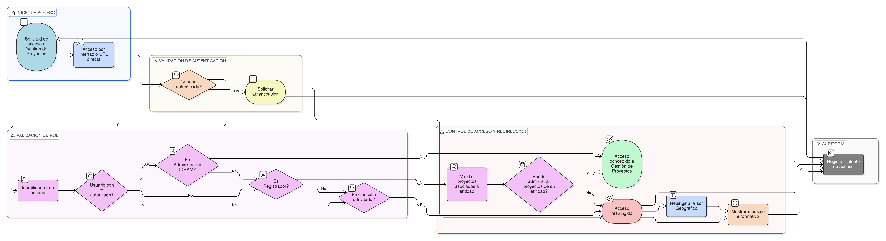

# HU-IDEAM-SNIF-REST-029

> **Identificador Historia de Usuario:** hu-ideam-snif-rest-029\
> **Nombre Historia de Usuario:** Control de acceso a la Gestión de Proyectos

> **Sistema de información:** Sistema Nacional de Información Forestal\
> **Módulo / subsistema:** Módulo de restauración\
> **Validador temático(s):** Raymond Alexander Jiménez Arteaga

## DESCRIPCIÓN HISTORIA DE USUARIO

> **Como:** sistema.\
> **Quiero:** restringir el acceso a la aplicación de Gestión de Proyectos.\
> **Para:** garantizar el cumplimiento del modelo institucional de roles.

## ALCANCE FUNCIONAL

- Control de acceso por rol a la **aplicación de Gestión de Proyectos**.
- Validación de acceso tanto a nivel de interfaz como por acceso directo a la URL.
- Redirección controlada hacia el Visor Geográfico cuando el usuario no tiene permisos de gestión.
- Mensajería informativa al usuario sobre el motivo de la restricción de acceso.

## CRITERIOS DE ACEPTACIÓN

1. **Acceso a la aplicación de Gestión**\
   1.1 El sistema permite el acceso a la aplicación de Gestión únicamente a usuarios autenticados con rol autorizado.\
   1.2 Los roles autorizados para acceder a la Gestión son Registrador y Administrador IDEAM.

2. **Restricción por rol**\
   2.1 El rol Registrador puede acceder a la Gestión únicamente para administrar proyectos asociados a su entidad.\
   2.2 El rol Administrador IDEAM puede acceder a la Gestión para administrar todos los proyectos del sistema.\
   2.3 El rol Consulta / Invitado no puede acceder a la aplicación de Gestión.

3. **Bloqueo de acceso por URL**\
   3.1 El sistema bloquea el acceso directo a la aplicación de Gestión mediante URL cuando el usuario no tiene permisos.\
   3.2 El sistema redirige automáticamente al Visor Geográfico cuando se detecta un acceso no autorizado.

4. **Mensajes informativos**\
   4.1 El sistema muestra un mensaje informativo indicando que el usuario no tiene permisos para acceder a la Gestión de Proyectos.\
   4.2 El mensaje informa que la consulta de proyectos está disponible desde el Visor Geográfico.

5. **Aplicación transversal**\
   5.1 El control de acceso definido en esta historia se aplica de forma transversal a todas las funcionalidades de la Gestión de Proyectos.\
   5.2 Ninguna funcionalidad de creación, edición o validación puede ser accedida sin pasar por este control.

6. **Auditoría de accesos**\
   6.1 El sistema registra los intentos de acceso a la aplicación de Gestión para efectos de auditoría y seguridad.

## ROLES

- **Administrador IDEAM**: Accede a la aplicación de Gestión y administra todos los proyectos del sistema.  
- **Registrador**: Accede a la aplicación de Gestión y administra únicamente los proyectos asociados a su entidad.  
- **Consulta / Invitado**: No tiene acceso a la aplicación de Gestión y es redirigido al Visor Geográfico.

## RESTRICCIONES Y LÍMITES

- El acceso a la aplicación de Gestión está restringido exclusivamente a los roles definidos.  
- No se permite el acceso parcial a la Gestión; el usuario accede o es bloqueado completamente.  
- El bloqueo de acceso debe aplicarse tanto en frontend como en backend.  
- Esta historia de usuario no contempla la configuración dinámica de roles o permisos.  
- La redirección al Visor Geográfico no habilita funcionalidades de edición o validación.

## DIAGRAMA DE FLUJO DEL PROCESO

