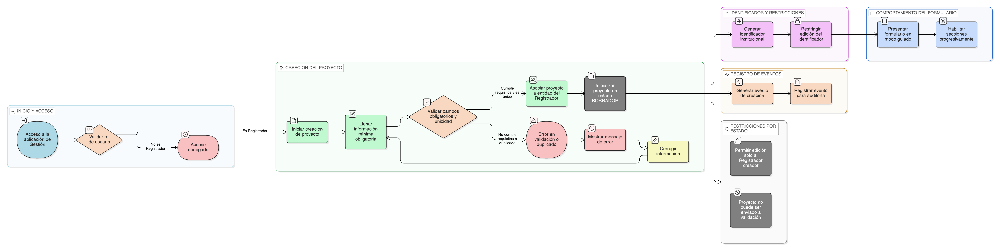

# HU-IDEAM-SNIF-REST-030

> **Identificador Historia de Usuario:** hu-ideam-snif-rest-030\
> **Nombre Historia de Usuario:** Crear un proyecto de restauración

> **Sistema de información:** Sistema Nacional de Información Forestal\
> **Módulo / subsistema:** Módulo de restauración – Aplicación de Gestión\
> **Validador temático(s):** Raymond Alexander Jiménez Arteaga

## DESCRIPCIÓN HISTORIA DE USUARIO

> **Como:** Registrador.\
> **Quiero:** crear un proyecto de restauración desde la aplicación de Gestión.\
> **Para:** registrar la definición conceptual de una iniciativa de restauración en el SNIF.

## ALCANCE FUNCIONAL

- Creación de proyectos **exclusivamente desde la aplicación de Gestión**.
- Asociación automática del proyecto a la **entidad del Registrador**.
- Inicialización del proyecto en estado **BORRADOR**.
- Registro de información mínima obligatoria para la creación del proyecto.
- Generación del identificador institucional del proyecto.
- Habilitación progresiva de secciones posteriores del formulario una vez el proyecto ha sido guardado.

## CRITERIOS DE ACEPTACIÓN

1. **Acceso y rol**\
   1.1 Solo usuarios con rol **Registrador** pueden crear proyectos desde la aplicación de Gestión.\
   1.2 El rol Administrador IDEAM no crea proyectos, únicamente los valida o consulta.

2. **Creación del proyecto**\
   2.1 El sistema permite crear un nuevo proyecto únicamente desde la aplicación de Gestión.\
   2.2 Al crear el proyecto, el sistema lo registra en estado **BORRADOR**.\
   2.3 El proyecto queda automáticamente asociado a la entidad del Registrador.

3. **Identificador del proyecto**\
   3.1 Al guardar el proyecto por primera vez, el sistema genera un identificador único institucional.\
   3.2 El identificador sigue el formato definido por el IDEAM (`SNIF-REST-<SIGLA ENTIDAD>-<AÑO>-<CONSECUTIVO>`). ej: **SNIF-REST-CDMB-2026-0001**.\
   3.3 El identificador no puede ser editado por ningún usuario.

4. **Validaciones del dato**\
   4.1 El sistema valida la obligatoriedad de los campos mínimos requeridos para la creación del proyecto.\
   4.2 El sistema valida la **unicidad del proyecto** conforme a las reglas definidas en la [HU-IDEAM-SNIF-REST-050](/historias_usuario/EP-IDEAM-SNIF-REST-050.md).\
   4.3 Cuando se detecta un posible duplicado, el sistema informa al usuario y bloquea la creación.

5. **Comportamiento del formulario**\
   5.1 El formulario de creación se presenta en modo guiado.\
   5.2 Las pestañas o secciones posteriores al registro inicial permanecen deshabilitadas hasta guardar el proyecto.\
   5.3 El sistema muestra mensajes claros cuando existen errores de validación.

6. **Eventos del sistema**\
   6.1 Al crear el proyecto, el sistema genera un evento institucional de creación.\
   6.2 El evento queda registrado para efectos de auditoría y seguimiento.

7. **Restricciones por estado**\
   7.1 El proyecto en estado **BORRADOR** es editable únicamente por el Registrador que lo creó.\
   7.2 El proyecto no puede ser enviado a validación desde esta historia de usuario.

## ROLES

- **Registrador**: Crea proyectos de restauración asociados a su entidad desde la aplicación de Gestión.  
- **Administrador IDEAM**: No crea proyectos; accede posteriormente para validación y consulta.  
- **Consulta / Invitado**: No tiene acceso a la aplicación de Gestión.

## RESTRICCIONES Y LÍMITES

- La creación de proyectos solo se permite desde la aplicación de Gestión.  
- Todo proyecto nuevo se crea obligatoriamente en estado **BORRADOR**.  
- El proyecto queda asociado de forma automática a la entidad del Registrador.  
- No se permite la creación de proyectos desde el Visor Geográfico.  
- Esta historia de usuario no contempla el envío del proyecto a validación IDEAM.

## DIAGRAMA DE FLUJO DEL PROCESO

