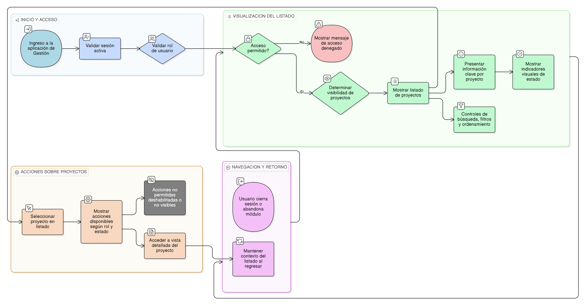

# HU-IDEAM-SNIF-REST-031

> **Identificador Historia de Usuario:** hu-ideam-snif-rest-031\
> **Nombre Historia de Usuario:** Consultar y listar proyectos en Gestión

> **Sistema de información:** Sistema Nacional de Información Forestal\
> **Módulo / subsistema:** Módulo de restauración – Aplicación de Gestión\
> **Validador temático(s):** Raymond Alexander Jiménez Arteaga

## DESCRIPCIÓN HISTORIA DE USUARIO

> **Como:** usuario con acceso a la aplicación de Gestión.\
> **Quiero:** consultar y listar los proyectos de restauración registrados en el sistema.\
> **Para:** acceder, gestionar y dar seguimiento a los proyectos según mi rol y permisos.

## ALCANCE FUNCIONAL

- Listado de proyectos **exclusivamente desde la aplicación de Gestión**.
- Visualización de proyectos conforme al rol del usuario.
- Acceso a acciones contextuales sobre cada proyecto desde el listado.
- Soporte para búsqueda, filtros y ordenamiento.

## CRITERIOS DE ACEPTACIÓN

1. **Acceso al listado**\
   1.1 El sistema permite acceder al listado de proyectos únicamente desde la aplicación de Gestión.\
   1.2 Solo los usuarios con rol **Registrador** o **Administrador IDEAM** pueden acceder al listado.

2. **Visibilidad por rol**\
   2.1 El rol Registrador visualiza únicamente los proyectos asociados a su entidad.\
   2.2 El rol Administrador IDEAM visualiza todos los proyectos del sistema.\
   2.3 El rol Consulta / Invitado no tiene acceso al listado en Gestión.

3. **Información presentada**\
   3.1 El listado presenta, como mínimo, la siguiente información por proyecto:
       - Identificador institucional  
       - Nombre del proyecto  
       - Estado del proyecto  
       - Entidad responsable  
       - Fecha de última actualización  
   3.2 El estado del proyecto se presenta con un indicador visual claro.

4. **Búsqueda, filtros y ordenamiento**\
   4.1 El sistema permite buscar proyectos por identificador o nombre.\
   4.2 El sistema permite filtrar proyectos por estado.\
   4.3 El sistema permite ordenar el listado por columnas disponibles.

5. **Acciones desde el listado**\
   5.1 El sistema presenta acciones disponibles por proyecto según el rol y el estado.\
   5.2 Las acciones no permitidas se muestran deshabilitadas o no visibles.

6. **Navegación**\
   6.1 Desde el listado, el usuario puede acceder a la vista detallada del proyecto.\
   6.2 La navegación mantiene el contexto del listado al regresar.

7. **Experiencia de usuario (UX)**\
   7.1 El listado de proyectos se presenta como una data table clara y legible, optimizada para la gestión operativa.\
   7.2 El estado del proyecto se visualiza mediante indicadores visuales consistentes que permiten identificar rápidamente su situación.\
   7.3 Las acciones disponibles por proyecto se muestran de forma contextual según el rol del usuario y el estado del proyecto.\
   7.4 Las acciones no permitidas se presentan deshabilitadas o no visibles, evitando errores por intentos no autorizados.\
   7.5 El listado incluye controles visibles de búsqueda, filtros y ordenamiento sin requerir navegación adicional.\
   7.6 Al acceder a la vista detallada de un proyecto, el sistema mantiene el contexto del listado (filtros y posición) al regresar.\
   7.7 Los mensajes del sistema se presentan de forma clara, no intrusiva y coherente con el resto de la aplicación de Gestión.\
   7.8 El comportamiento visual y funcional del listado es consistente con los demás módulos del SNIF.

## ROLES

- **Administrador IDEAM**: Consulta y gestiona todos los proyectos del sistema desde la aplicación de Gestión.  
- **Registrador**: Consulta y gestiona los proyectos asociados a su entidad desde la aplicación de Gestión.  
- **Consulta / Invitado**: No tiene acceso al listado de proyectos en Gestión.

## RESTRICCIONES Y LÍMITES

- El listado de proyectos en Gestión no incluye proyectos visibles únicamente en el Visor Geográfico.  
- Los usuarios solo pueden visualizar proyectos conforme a su rol y entidad.  
- El acceso al listado está restringido por el control de acceso definido en la [HU-IDEAM-SNIF-REST-029](/historias_usuario/EP-IDEAM-SNIF-REST-004/HU-IDEAM-SNIF-REST-029.md).  
- Esta historia de usuario no contempla la edición directa de proyectos sin acceder a su vista detallada.

## DIAGRAMA DE FLUJO DEL PROCESO

