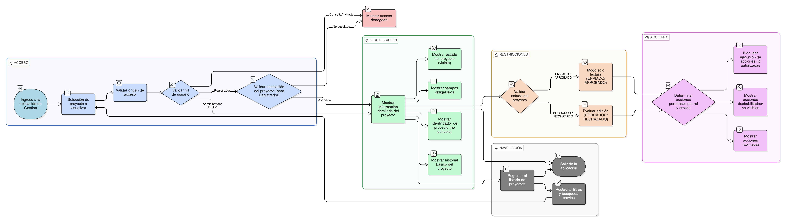

# HU-IDEAM-SNIF-REST-032

> **Identificador Historia de Usuario:** hu-ideam-snif-rest-032\
> **Nombre Historia de Usuario:** Ver información del proyecto

> **Sistema de información:** Sistema Nacional de Información Forestal\
> **Módulo / subsistema:** Módulo de restauración – Aplicación de Gestión\
> **Validador temático(s):** Raymond Alexander Jiménez Arteaga

## DESCRIPCIÓN HISTORIA DE USUARIO

> **Como:** usuario con acceso a la aplicación de Gestión.\
> **Quiero:** visualizar la información detallada de un proyecto de restauración.\
> **Para:** consultar su estado, contenido registrado y avanzar en su gestión o validación según mi rol.

## ALCANCE FUNCIONAL

- Visualización detallada de un proyecto **exclusivamente desde la aplicación de Gestión**.
- Consulta estructurada de toda la información registrada del proyecto.
- Visualización del estado actual del proyecto y su historial básico.
- Acceso a acciones permitidas según el rol y el estado del proyecto.

## CRITERIOS DE ACEPTACIÓN

1. **Acceso a la vista del proyecto**\
   1.1 El sistema permite acceder a la vista detallada de un proyecto únicamente desde la aplicación de Gestión.\
   1.2 Solo los roles Registrador y Administrador IDEAM pueden acceder a la vista del proyecto.\
   1.3 El rol Consulta / Invitado no tiene acceso a esta funcionalidad.

2. **Visibilidad por rol**\
   2.1 El rol Registrador puede visualizar únicamente los proyectos asociados a su entidad.\
   2.2 El rol Administrador IDEAM puede visualizar cualquier proyecto del sistema.

3. **Campos visualizados del proyecto**\
   3.1 El sistema presenta la información del proyecto en modo solo lectura, utilizando etiquetas informativas.\
   3.2 El sistema visualiza como mínimo los siguientes campos del proyecto:
       - Identificador del proyecto  
       - Nombre del proyecto  
       - Estado del proyecto  
       - Entidad responsable  
       - Tipo de proyecto  
       - Tipo de trámite  
       - Tipo de acto administrativo  
       - Número de acto administrativo, cuando aplique  
       - Fecha del acto administrativo, cuando aplique  
       - Descripción del proyecto  
       - Objetivo del proyecto  
       - Área estimada de intervención  
       - Ubicación general  
       - Fecha de creación del proyecto  
       - Fecha de última actualización  
   3.3 Los valores visualizados corresponden a la información registrada en el sistema.\
   3.4 El identificador del proyecto se muestra de forma permanente y no editable.\
   3.5 El estado del proyecto se presenta de forma visible.

4. **Restricciones por estado**\
   4.1 Cuando el proyecto se encuentra en estado ENVIADO, la información se presenta en modo solo lectura.\
   4.2 Cuando el proyecto se encuentra en estado APROBADO, la información se presenta en modo solo lectura.\
   4.3 Cuando el proyecto se encuentra en estado BORRADOR o RECHAZADO, la edición depende de las reglas definidas en historias posteriores.

5. **Acciones disponibles**\
   5.1 El sistema muestra únicamente las acciones permitidas según el rol del usuario y el estado del proyecto.\
   5.2 Las acciones no permitidas se muestran deshabilitadas o no visibles.\
   5.3 El sistema no permite ejecutar acciones no autorizadas por estado o rol.

6. **Navegación**\
   6.1 Desde la vista del proyecto, el usuario puede regresar al listado de proyectos.\
   6.2 Al regresar al listado, el sistema conserva los filtros, búsqueda y posición previa.

## ROLES

- **Administrador IDEAM**: Visualiza la información completa de cualquier proyecto para efectos de validación y seguimiento.  
- **Registrador**: Visualiza la información de los proyectos asociados a su entidad para su gestión.  
- **Consulta / Invitado**: No tiene acceso a la visualización de proyectos desde la aplicación de Gestión.

## RESTRICCIONES Y LÍMITES

- La visualización del proyecto solo está disponible desde la aplicación de Gestión.  
- No se permite la edición de proyectos en estados ENVIADO o APROBADO.  
- El acceso y las acciones disponibles dependen estrictamente del rol y del estado del proyecto.  
- Esta historia de usuario no contempla la visualización pública del proyecto en el Visor Geográfico.

## DIAGRAMA DE FLUJO DEL PROCESO

