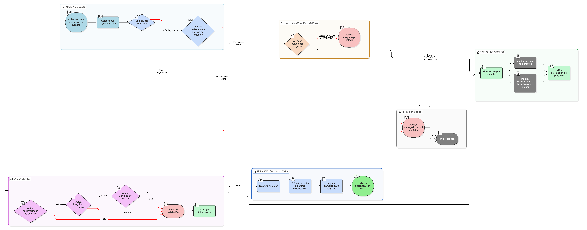

# HU-IDEAM-SNIF-REST-033

> **Identificador Historia de Usuario:** hu-ideam-snif-rest-033\
> **Nombre Historia de Usuario:** Editar un proyecto de restauración

> **Sistema de información:** Sistema Nacional de Información Forestal\
> **Módulo / subsistema:** Módulo de restauración – Aplicación de Gestión\
> **Validador temático(s):** Raymond Alexander Jiménez Arteaga

## DESCRIPCIÓN HISTORIA DE USUARIO

> **Como:** Registrador.\
> **Quiero:** editar la información de un proyecto de restauración que he creado.\
> **Para:** completar, corregir o actualizar la información antes de enviarlo a validación institucional.

## ALCANCE FUNCIONAL

- Edición de proyectos **exclusivamente desde la aplicación de Gestión**.
- Edición permitida únicamente para proyectos en estados **BORRADOR** o **RECHAZADO**.
- Aplicación de validaciones, reglas de integridad y unicidad.
- Registro de cambios para auditoría.

## CRITERIOS DE ACEPTACIÓN

1. **Acceso a la edición**\
   1.1 Solo el rol Registrador puede editar proyectos desde la aplicación de Gestión.\
   1.2 El Registrador solo puede editar proyectos asociados a su entidad.\
   1.3 El rol Administrador IDEAM no puede editar proyectos.\
   1.4 El rol Consulta / Invitado no tiene acceso a la edición.

2. **Restricciones por estado**\
   2.1 El sistema permite editar proyectos únicamente cuando se encuentran en estado **BORRADOR** o **RECHAZADO**.\
   2.2 Cuando el proyecto se encuentra en estado **ENVIADO** o **APROBADO**, el sistema bloquea completamente la edición.

3. **Campos editables del proyecto**\
   3.1 El sistema permite editar los siguientes campos del proyecto:
   - Nombre del proyecto  
   - Descripción del proyecto  
   - Objetivo del proyecto  
   - Tipo de proyecto  
   - Tipo de trámite  
   - Tipo de acto administrativo  
   - Número de acto administrativo (cuando aplique)  
   - Fecha del acto administrativo (cuando aplique)  
   - Área estimada de intervención  
   - Ubicación general  
   - Información contextual del proyecto  

4. **Campos no editables (bloqueados)**\
   4.1 El sistema **no permite editar** los siguientes campos:
   - Identificador institucional del proyecto  
   - Entidad responsable  
   - Fecha de creación del proyecto  
   - Estado del proyecto  

5. **Comportamiento según estado RECHAZADO**\
   5.1 Cuando el proyecto se encuentra en estado **RECHAZADO**, el sistema permite la edición de los campos definidos como editables.\
   5.2 Las observaciones de rechazo se presentan en modo solo lectura y no son editables por el Registrador.

6. **Validaciones del dato**\
   6.1 El sistema valida la obligatoriedad de los campos según las reglas definidas.\
   6.2 El sistema aplica validaciones de integridad referencial con los catálogos definidos en la Épica 003.\
   6.3 El sistema aplica las reglas de unicidad del proyecto definidas en la [HU-IDEAM-SNIF-REST-050](HU-IDEAM-SNIF-REST-050.md).

7. **Persistencia y auditoría**\
   7.1 El sistema guarda los cambios realizados por el Registrador.\
   7.2 El sistema actualiza la fecha de última modificación del proyecto.\
   7.3 Los cambios quedan registrados para efectos de auditoría.

## ROLES

- **Registrador**: Edita proyectos de su entidad en estados BORRADOR o RECHAZADO.  
- **Administrador IDEAM**: Consulta y valida proyectos; no edita.  
- **Consulta / Invitado**: No tiene acceso a la edición.

## RESTRICCIONES Y LÍMITES

- La edición solo está disponible desde la aplicación de Gestión.  
- No se permite editar proyectos en estado ENVIADO o APROBADO.  
- El identificador institucional, la entidad y el estado del proyecto nunca son editables.  
- Esta historia de usuario no contempla el envío del proyecto a validación IDEAM.

## DIAGRAMA DE FLUJO DEL PROCESO

