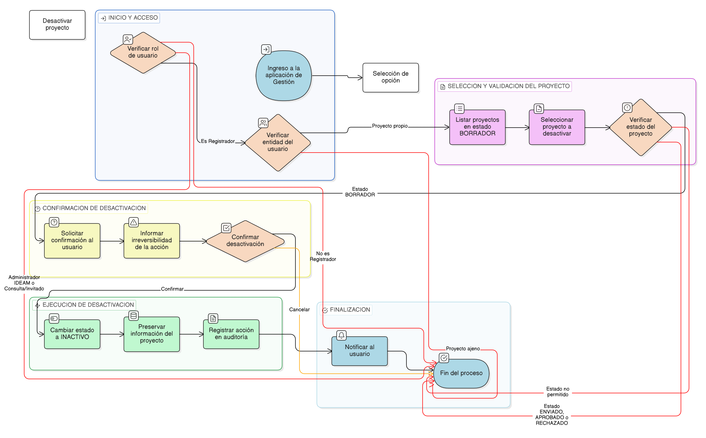

# HU-IDEAM-SNIF-REST-034

> **Identificador Historia de Usuario:** hu-ideam-snif-rest-034\
> **Nombre Historia de Usuario:** Desactivar (borrado lógico) un proyecto de restauración

> **Sistema de información:** Sistema Nacional de Información Forestal\
> **Módulo / subsistema:** Módulo de restauración – Aplicación de Gestión\
> **Validador temático(s):** Raymond Alexander Jiménez Arteaga

## DESCRIPCIÓN HISTORIA DE USUARIO

> **Como:** Registrador.\
> **Quiero:** desactivar un proyecto de restauración que he creado.\
> **Para:** retirar proyectos que no continuarán su trámite sin eliminarlos del sistema y manteniendo la trazabilidad.

## ALCANCE FUNCIONAL

- Desactivación lógica de proyectos **exclusivamente desde la aplicación de Gestión**.
- Cambio de estado del proyecto a **INACTIVO** sin eliminación física del registro.
- Preservación completa de la información histórica del proyecto.
- Registro de la acción para efectos de auditoría.

## CRITERIOS DE ACEPTACIÓN

1. **Acceso a la desactivación**\
   1.1 Solo el rol **Registrador** puede desactivar proyectos desde la aplicación de Gestión.\
   1.2 El Registrador solo puede desactivar proyectos asociados a su entidad.\
   1.3 El rol Administrador IDEAM no puede desactivar proyectos.\
   1.4 El rol Consulta / Invitado no tiene acceso a esta funcionalidad.

2. **Restricciones por estado**\
   2.1 El sistema permite desactivar proyectos únicamente cuando se encuentran en estado **BORRADOR**.\
   2.2 El sistema bloquea la desactivación de proyectos en estados **ENVIADO**, **APROBADO** o **RECHAZADO**.

3. **Comportamiento de la desactivación**\
   3.1 Al desactivar un proyecto, el sistema cambia su estado a **INACTIVO**.\
   3.2 El proyecto desactivado no se elimina físicamente del sistema.\
   3.3 El proyecto desactivado no puede ser editado ni enviado a validación.

4. **Impacto sobre la información del proyecto**\
   4.1 Toda la información registrada del proyecto se conserva sin modificaciones.\
   4.2 El identificador institucional del proyecto permanece inalterado.\
   4.3 El proyecto desactivado no se presenta en los listados operativos por defecto.

5. **Confirmación de la acción**\
   5.1 Antes de ejecutar la desactivación, el sistema solicita confirmación explícita al usuario.\
   5.2 El sistema informa al usuario que la desactivación es irreversible.

6. **Auditoría**\
   6.1 El sistema registra la desactivación del proyecto indicando:
       - Usuario que ejecuta la acción  
       - Fecha y hora  
       - Estado anterior y nuevo estado  
   6.2 El registro de auditoría no puede ser modificado ni eliminado.

## ROLES

- **Registrador**: Desactiva proyectos propios en estado BORRADOR.  
- **Administrador IDEAM**: Consulta proyectos; no puede desactivarlos.  
- **Consulta / Invitado**: No tiene acceso a la desactivación de proyectos.

## RESTRICCIONES Y LÍMITES

- La desactivación de proyectos solo está disponible desde la aplicación de Gestión.  
- No se permite la desactivación de proyectos que hayan sido enviados a validación o aprobados.  
- Un proyecto desactivado no puede reactivarse.  
- Esta historia de usuario no contempla la eliminación física de proyectos.

## DIAGRAMA DE FLUJO DEL PROCESO

