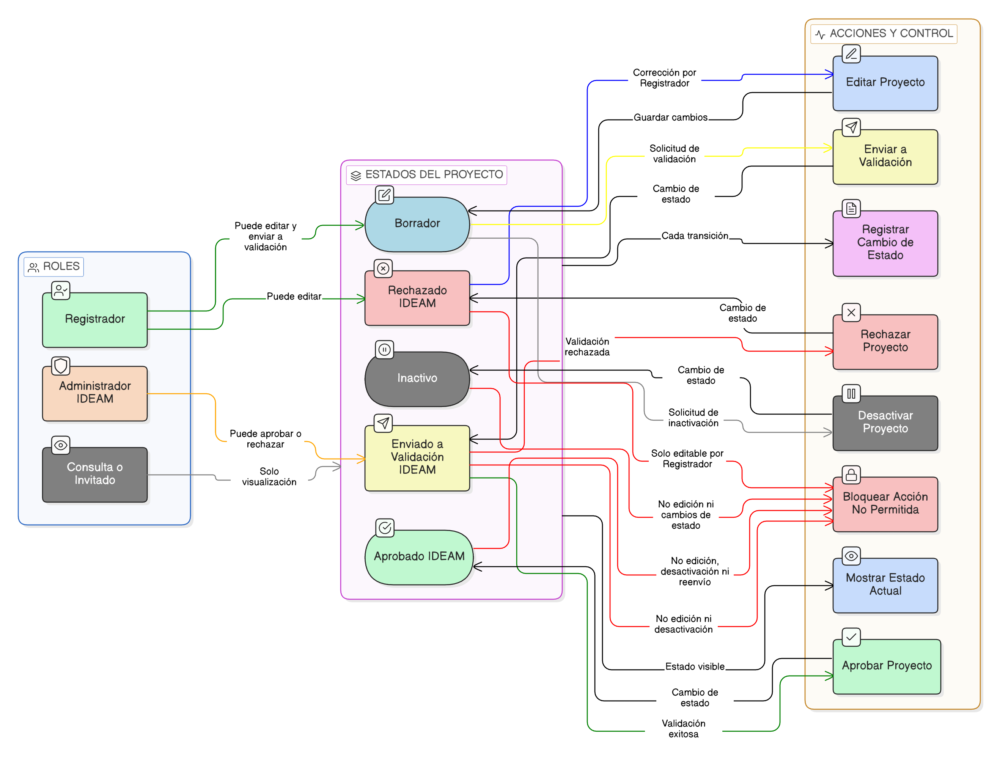

# HU-IDEAM-SNIF-REST-035

> **Identificador Historia de Usuario:** hu-ideam-snif-rest-035\
> **Nombre Historia de Usuario:** Gestión de estado del proyecto

> **Sistema de información:** Sistema Nacional de Información Forestal\
> **Módulo / subsistema:** Módulo de restauración – Aplicación de Gestión\
> **Validador temático(s):** Raymond Alexander Jiménez Arteaga

## DESCRIPCIÓN HISTORIA DE USUARIO

> **Como:** sistema.\
> **Quiero:** gestionar y controlar los cambios de estado de un proyecto de restauración.\
> **Para:** garantizar que el ciclo de vida del proyecto se cumpla conforme al flujo institucional definido por el IDEAM.

## ALCANCE FUNCIONAL

- Control centralizado del estado del proyecto.
- Aplicación estricta del flujo de estados definido para los proyectos de restauración.
- Bloqueo de acciones según el estado actual del proyecto.
- Registro de cada cambio de estado para efectos de trazabilidad.

## CRITERIOS DE ACEPTACIÓN

1. **Estados del proyecto**\
   1.1 El sistema reconoce los siguientes estados del proyecto:
   - BORRADOR  
   - ENVIADO A VALIDACIÓN IDEAM  
   - APROBADO IDEAM  
   - RECHAZADO IDEAM  
   - INACTIVO  

2. **Flujo permitido de estados**\
   2.1 El sistema permite el cambio de estado de **BORRADOR** a **ENVIADO A VALIDACIÓN IDEAM** únicamente mediante la funcionalidad definida en la [HU-IDEAM-SNIF-REST-034](HU-IDEAM-SNIF-REST-034.md).\
   2.2 El sistema permite el cambio de estado de **ENVIADO A VALIDACIÓN IDEAM** a **APROBADO IDEAM** o **RECHAZADO IDEAM**.\
   2.3 El sistema permite el cambio de estado de **BORRADOR** a **INACTIVO** únicamente mediante la funcionalidad definida en la [HU-IDEAM-SNIF-REST-034](HU-IDEAM-SNIF-REST-034.md).\
   2.4 No se permiten transiciones de estado distintas a las definidas.

3. **Restricciones por estado**\
   3.1 Un proyecto en estado **ENVIADO A VALIDACIÓN IDEAM** no puede ser editado ni desactivado.\
   3.2 Un proyecto en estado **APROBADO IDEAM** no puede ser editado, desactivado ni enviado nuevamente a validación.\
   3.3 Un proyecto en estado **RECHAZADO IDEAM** puede ser editado únicamente por el Registrador, conforme a la HU-033.\
   3.4 Un proyecto en estado **INACTIVO** no puede ser editado ni cambiar de estado.

4. **Control de acciones**\
   4.1 El sistema habilita o bloquea las acciones disponibles sobre el proyecto según su estado actual.\
   4.2 El sistema bloquea cualquier intento de cambio de estado no permitido.

5. **Persistencia del estado**\
   5.1 El estado del proyecto se almacena de forma persistente en el sistema.\
   5.2 El estado actual del proyecto se muestra de forma visible en todas las vistas del proyecto.

6. **Auditoría de cambios de estado**\
   6.1 El sistema registra cada cambio de estado del proyecto indicando:
       - Estado anterior  
       - Nuevo estado  
       - Usuario responsable  
       - Fecha y hora del cambio  
   6.2 Los registros de auditoría no pueden ser modificados ni eliminados.

## ROLES

- **Registrador**: Gestiona proyectos en estado BORRADOR y corrige proyectos RECHAZADOS.  
- **Administrador IDEAM**: Cambia el estado de los proyectos durante el proceso de validación.  
- **Consulta / Invitado**: No interviene en la gestión de estados del proyecto.

## RESTRICCIONES Y LÍMITES

- Los cambios de estado solo pueden realizarse a través de las funcionalidades explícitamente definidas.  
- No se permite modificar manualmente el estado del proyecto.  
- Un proyecto en estado INACTIVO no puede reactivarse.  

## DIAGRAMA DE FLUJO DEL PROCESO

