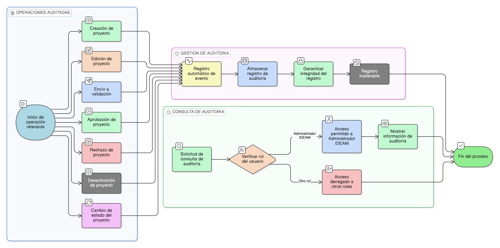

# HU-IDEAM-SNIF-REST-036

> **Identificador Historia de Usuario:** hu-ideam-snif-rest-036\
> **Nombre Historia de Usuario:** Auditoría y trazabilidad del proyecto

> **Sistema de información:** Sistema Nacional de Información Forestal\
> **Módulo / subsistema:** Módulo de restauración – Aplicación de Gestión\
> **Validador temático(s):** Raymond Alexander Jiménez Arteaga

## DESCRIPCIÓN HISTORIA DE USUARIO

> **Como:** sistema.\
> **Quiero:** registrar y conservar la trazabilidad completa de las operaciones realizadas sobre un proyecto de restauración.\
> **Para:** garantizar control institucional, transparencia y soporte a procesos de seguimiento y auditoría.

## ALCANCE FUNCIONAL

- Auditoría transversal sobre todas las operaciones realizadas durante el ciclo de vida del proyecto.
- Registro automático de eventos relevantes sin intervención del usuario.
- Consulta de la información auditada como soporte a procesos institucionales.

## CRITERIOS DE ACEPTACIÓN

1. **Eventos auditados**\
   1.1 El sistema registra todas las operaciones relevantes realizadas sobre un proyecto.\
   1.2 Las operaciones auditadas incluyen como mínimo:
   - Creación del proyecto  
   - Edición del proyecto  
   - Envío a validación  
   - Aprobación del proyecto  
   - Rechazo del proyecto  
   - Desactivación del proyecto  
   - Cambios de estado  

2. **Información registrada en la auditoría**\
   2.1 Cada evento de auditoría incluye:
   - Identificador del proyecto  
   - Tipo de evento  
   - Usuario que ejecuta la acción  
   - Rol del usuario  
   - Fecha y hora del evento  
   - Estado anterior del proyecto, cuando aplique  
   - Nuevo estado del proyecto, cuando aplique  

3. **Persistencia e integridad**\
   3.1 Los registros de auditoría se almacenan de forma persistente.\
   3.2 Los registros de auditoría no pueden ser editados ni eliminados por ningún usuario.\
   3.3 El sistema garantiza la integridad de la información auditada.

4. **Disponibilidad de la trazabilidad**\
   4.1 La información de auditoría está disponible para consulta por el rol Administrador IDEAM.\
   4.2 La auditoría puede ser utilizada como insumo para procesos de control y seguimiento institucional.

5. **Relación con el proyecto**\
   5.1 La auditoría se asocia de forma directa e inequívoca a cada proyecto.\
   5.2 La trazabilidad del proyecto se mantiene aun cuando el proyecto se encuentre en estado INACTIVO.

## ROLES

- **Administrador IDEAM**: Consulta la auditoría y trazabilidad de los proyectos.  
- **Registrador**: No modifica ni elimina la información de auditoría.  
- **Consulta / Invitado**: No tiene acceso a la auditoría del proyecto.

## RESTRICCIONES Y LÍMITES

- La auditoría se genera automáticamente y no puede ser deshabilitada.  
- No se permite la modificación ni eliminación de registros de auditoría.  
- Esta historia de usuario no contempla la exportación de la información de auditoría.  
- La auditoría no permite la reversión automática de acciones realizadas sobre el proyecto.

## DIAGRAMA DE FLUJO DEL PROCESO

