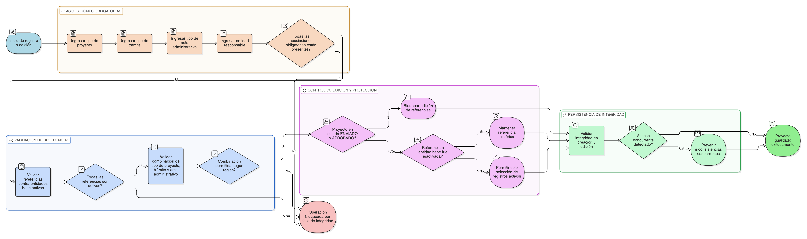

# HU-IDEAM-SNIF-REST-037

> **Identificador Historia de Usuario:** hu-ideam-snif-rest-037\
> **Nombre Historia de Usuario:** Integridad referencial del proyecto

> **Sistema de información:** Sistema Nacional de Información Forestal\
> **Módulo / subsistema:** Módulo de restauración – Aplicación de Gestión\
> **Validador temático(s):** Raymond Alexander Jiménez Arteaga

## DESCRIPCIÓN HISTORIA DE USUARIO

> **Como:** sistema.\
> **Quiero:** garantizar la integridad referencial de la información asociada a los proyectos de restauración.\
> **Para:** asegurar la coherencia del dato, evitar inconsistencias y mantener alineación con los catálogos y entidades base del sistema.

## ALCANCE FUNCIONAL

- Validación de referencias entre el proyecto y las entidades base definidas en la [EP-IDEAM-SNIF-REST-003](../EP-IDEAM-SNIF-REST-003.md).
- Bloqueo de operaciones que generen inconsistencias referenciales.
- Protección de proyectos existentes ante cambios en catálogos maestros.
- Aplicación transversal de las reglas de integridad durante todo el ciclo de vida del proyecto.

## CRITERIOS DE ACEPTACIÓN

1. **Referencias obligatorias del proyecto**\
   1.1 Todo proyecto debe estar asociado obligatoriamente a:
   - Tipo de proyecto  
   - Tipo de trámite  
   - Tipo de acto administrativo  
   - Entidad responsable  

2. **Validación contra entidades base**\
   2.1 El sistema valida que los valores seleccionados correspondan a registros activos en las entidades base.\
   2.2 El sistema impide guardar o actualizar un proyecto cuando alguna referencia no es válida o se encuentra inactiva.

3. **Protección ante cambios en catálogos**\
   3.1 Cuando un registro de una entidad base es inactivado, los proyectos existentes que lo referencian mantienen la referencia histórica.\
   3.2 El sistema no permite seleccionar registros inactivos para nuevos proyectos o ediciones.

4. **Restricciones en edición y validación**\
   4.1 El sistema bloquea la edición de referencias a entidades base cuando el proyecto se encuentra en estado ENVIADO o APROBADO.\
   4.2 El sistema valida la integridad referencial antes de permitir el envío del proyecto a validación.

5. **Coherencia de combinaciones permitidas**\
   5.1 El sistema valida que la combinación Tipo de Proyecto – Tipo de Trámite – Tipo de Acto Administrativo sea válida conforme a las reglas definidas en la [EP-IDEAM-SNIF-REST-003](../EP-IDEAM-SNIF-REST-003.md).\
   5.2 El sistema bloquea el guardado del proyecto cuando la combinación no está permitida.

6. **Persistencia de la integridad**\
   6.1 La integridad referencial del proyecto se valida tanto en creación como en edición.\
   6.2 El sistema previene inconsistencias incluso ante accesos concurrentes.

## ROLES

- **Registrador**: Registra y edita proyectos respetando las reglas de integridad referencial.  
- **Administrador IDEAM**: Valida proyectos con integridad referencial garantizada.  
- **Consulta / Invitado**: Visualiza proyectos ya validados sin intervenir en la integridad del dato.

## RESTRICCIONES Y LÍMITES

- No se permite guardar ni validar proyectos con referencias inválidas o inconsistentes.  
- Los proyectos existentes conservan referencias históricas aun cuando los catálogos cambien de estado.  
- La integridad referencial es obligatoria y no puede ser deshabilitada.  
- Esta historia de usuario no contempla la modificación de catálogos o entidades base.

## DIAGRAMA DE FLUJO DEL PROCESO

