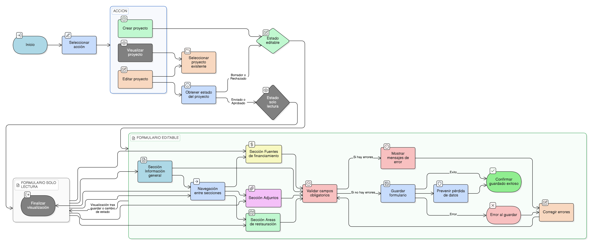

# HU-IDEAM-SNIF-REST-038

> **Identificador Historia de Usuario:** hu-ideam-snif-rest-038\
> **Nombre Historia de Usuario:** Comportamiento UX del formulario de proyecto

> **Sistema de información:** Sistema Nacional de Información Forestal\
> **Módulo / subsistema:** Módulo de restauración – Aplicación de Gestión\
> **Validador temático(s):** Raymond Alexander Jiménez Arteaga

## DESCRIPCIÓN HISTORIA DE USUARIO

> **Como:** usuario con acceso a la aplicación de Gestión.\
> **Quiero:** interactuar con un formulario de proyecto guiado, claro y consistente.\
> **Para:** registrar y gestionar proyectos de restauración reduciendo errores y omisiones de información.

## ALCANCE FUNCIONAL

- Definición del comportamiento de experiencia de usuario del formulario de proyecto.
- Aplicación de reglas UX obligatorias durante la creación, edición y visualización del proyecto.
- Soporte a la navegación guiada y validaciones dinámicas del formulario.

## CRITERIOS DE ACEPTACIÓN

1. **Estructura del formulario**\
   1.1 El formulario del proyecto se organiza en secciones o pasos claramente identificables.
   - Información general, habilitado por defecto
   - Fuentes de financiamiento, habilitado o deshabilitado según la necesidad.
   - Adjuntos, habilitado o deshabilitado según la necesidad.
   - Áreas de restauración, habilitado o deshabilitado según la necesidad.

   1.2 Cada sección agrupa campos relacionados de forma lógica.\
   1.3 Las secciones se presentan en un orden predefinido y consistente.

2. **Navegación guiada**\
   2.1 El usuario puede avanzar o retroceder entre secciones del formulario utilizando controles explícitos.\
   2.2 El sistema impide avanzar a secciones posteriores cuando existen errores de validación en la sección actual.\
   2.3 El sistema mantiene la información diligenciada al navegar entre secciones.

3. **Validaciones en el formulario**\
   3.1 Las validaciones de obligatoriedad se ejecutan de forma inmediata al interactuar con los campos.\
   3.2 El sistema muestra mensajes claros cuando un campo no cumple con las reglas definidas.\
   3.3 Los campos con errores se identifican visualmente.

4. **Comportamiento según estado del proyecto**\
   4.1 Cuando el proyecto se encuentra en estado BORRADOR o RECHAZADO, el formulario se presenta en modo editable.\
   4.2 Cuando el proyecto se encuentra en estado ENVIADO o APROBADO, el formulario se presenta en modo solo lectura.\
   4.3 El sistema bloquea cualquier intento de modificación no permitida por el estado del proyecto.

5. **Persistencia y retroalimentación**\
   5.1 El sistema informa al usuario cuando la información se guarda correctamente.\
   5.2 El sistema informa al usuario cuando ocurre un error al guardar la información.\
   5.3 El sistema previene la pérdida de información diligenciada por el usuario.

6. **Consistencia visual y funcional**\
   6.1 El comportamiento del formulario es consistente en todas las operaciones de creación, edición y visualización.\
   6.2 Los mensajes, validaciones y controles mantienen un lenguaje uniforme y comprensible.

## ROLES

- **Registrador**: Interactúa con el formulario para crear y editar proyectos.  
- **Administrador IDEAM**: Visualiza el formulario en modo solo lectura durante la validación.  
- **Consulta / Invitado**: No interactúa con el formulario en la aplicación de Gestión.

## RESTRICCIONES Y LÍMITES

- Las reglas de UX definidas en esta historia son obligatorias y no opcionales.  
- El comportamiento UX no puede ser modificado por el usuario.  
- Esta historia de usuario no contempla cambios en la estructura de los campos del formulario.  
- El formulario solo está disponible desde la aplicación de Gestión.

## DIAGRAMA DE FLUJO DEL PROCESO

