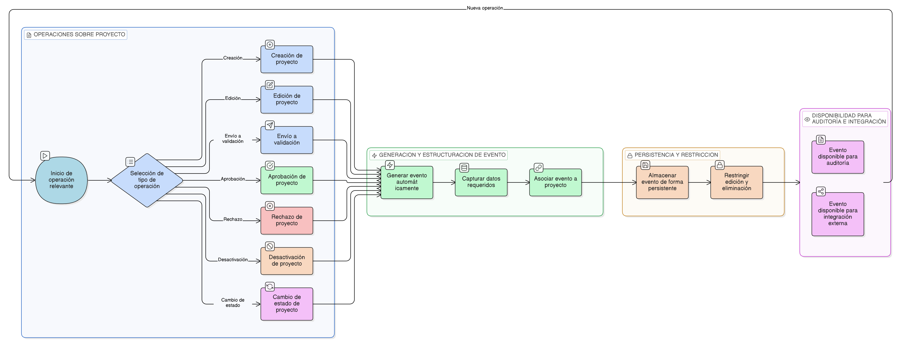

# HU-IDEAM-SNIF-REST-039

> **Identificador Historia de Usuario:** hu-ideam-snif-rest-039\
> **Nombre Historia de Usuario:** Generación de eventos del sistema

> **Sistema de información:** Sistema Nacional de Información Forestal\
> **Módulo / subsistema:** Módulo de restauración – Aplicación de Gestión\
> **Validador temático(s):** Raymond Alexander Jiménez Arteaga

## DESCRIPCIÓN HISTORIA DE USUARIO

> **Como:** sistema.\
> **Quiero:** generar eventos del sistema ante operaciones relevantes sobre los proyectos de restauración.\
> **Para:** soportar la trazabilidad institucional, la auditoría y notificaciones.

## ALCANCE FUNCIONAL

- Generación automática de eventos del sistema asociados al ciclo de vida del proyecto.
- Registro estructurado de eventos sin intervención del usuario.
- Asociación inequívoca de cada evento con el proyecto correspondiente.
- Disponibilidad de los eventos para procesos de auditoría e integración.

## CRITERIOS DE ACEPTACIÓN

1. **Eventos generados**\
   1.1 El sistema genera eventos ante las siguientes operaciones del proyecto:
   - Creación del proyecto  
   - Edición del proyecto  
   - Envío del proyecto a validación  
   - Aprobación del proyecto  
   - Rechazo del proyecto  
   - Desactivación del proyecto  
   - Cambio de estado del proyecto  

2. **Información del evento**\
   2.1 Cada evento generado incluye como mínimo:
   - Identificador del proyecto  
   - Tipo de evento  
   - Usuario que ejecuta la acción  
   - Rol del usuario  
   - Fecha y hora del evento  
   - Estado anterior del proyecto, cuando aplique  
   - Nuevo estado del proyecto, cuando aplique  

3. **Persistencia del evento**\
   3.1 Los eventos del sistema se almacenan de forma persistente.\
   3.2 Los eventos no pueden ser modificados ni eliminados por ningún usuario.

4. **Relación con auditoría**\
   4.1 Los eventos generados sirven como insumo para los procesos de auditoría definidos en la [HU-IDEAM-SNIF-REST-039](/historias_usuario/EP-IDEAM-SNIF-REST-004/HU-IDEAM-SNIF-REST-036.md).\
   4.2 La generación de eventos es independiente de la visualización de la auditoría.

5. **Integración y consistencia**\
   5.1 Cada evento se asocia de forma inequívoca a un único proyecto.\
   5.2 El sistema garantiza que no se generen eventos duplicados para una misma operación.\
   5.3 La generación de eventos no interrumpe la operación principal del sistema.

## ROLES

- **Sistema**: Genera y registra los eventos automáticamente.  
- **Administrador IDEAM**: Utiliza los eventos como insumo para auditoría y seguimiento.  
- **Registrador**: Genera eventos de forma indirecta al ejecutar operaciones sobre proyectos.

## RESTRICCIONES Y LÍMITES

- La generación de eventos es automática y no puede ser deshabilitada.  
- Los eventos no pueden ser editados ni eliminados.  
- Esta historia de usuario no contempla la visualización directa de los eventos al usuario final.  
- La generación de eventos no implica notificaciones automáticas (definidas en otras historias).

## DIAGRAMA DE FLUJO DEL PROCESO

