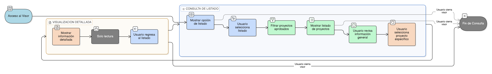

# HU-IDEAM-SNIF-REST-040

> **Identificador Historia de Usuario:** hu-ideam-snif-rest-040\
> **Nombre Historia de Usuario:** Acceder al listado de proyectos desde el visor GIS

> **Sistema de información:** Sistema Nacional de Información Forestal\
> **Módulo / subsistema:** Módulo de restauración – Visor Geográfico\
> **Validador temático(s):** Raymond Alexander Jiménez Arteaga

## DESCRIPCIÓN HISTORIA DE USUARIO

> **Como:** usuario del Visor Geográfico.\
> **Quiero:** acceder al listado de proyectos de restauración desde el visor GIS.\
> **Para:** consultar información general de los proyectos publicados en el SNIF.

## ALCANCE FUNCIONAL

- Acceso al listado de proyectos **exclusivamente desde el Visor Geográfico**.
- Consulta pública e institucional de proyectos de restauración.
- Visualización únicamente de proyectos en estado **APROBADO IDEAM**.
- Acceso a la información general del proyecto sin capacidades de edición.

## CRITERIOS DE ACEPTACIÓN

1. **Acceso desde el Visor Geográfico**\
   1.1 El sistema permite acceder al listado de proyectos únicamente desde el Visor Geográfico.\
   1.2 El acceso al listado no requiere autenticación obligatoria.

2. **Proyectos visibles**\
   2.1 El listado incluye únicamente proyectos en estado **APROBADO IDEAM**.\
   2.2 Los proyectos en estados BORRADOR, ENVIADO, RECHAZADO o INACTIVO no se visualizan en el Visor.

3. **Información presentada en el listado**\
   3.1 El sistema presenta, como mínimo, la siguiente información por proyecto:
       - Identificador del proyecto  
       - Nombre del proyecto  
       - Tipo de proyecto  
       - Entidad responsable  
       - Estado del proyecto  
   3.2 La información presentada corresponde a los datos validados del proyecto.

4. **Acceso a detalle desde el listado**\
   4.1 Desde el listado del Visor, el usuario puede acceder a la visualización detallada del proyecto.\
   4.2 La visualización detallada es de solo lectura.

5. **Separación Gestión – Visor**\
   5.1 El Visor Geográfico no permite crear, editar, desactivar ni validar proyectos.\
   5.2 No se presentan acciones de gestión en el listado del Visor.

## ROLES

- **Usuario público / Invitado**: Accede al listado de proyectos aprobados desde el Visor Geográfico.  
- **Registrador**: Consulta proyectos aprobados desde el Visor Geográfico.  
- **Administrador IDEAM**: Consulta proyectos aprobados desde el Visor Geográfico.

## RESTRICCIONES Y LÍMITES

- El Visor Geográfico es exclusivamente de consulta.  
- Solo los proyectos aprobados son visibles públicamente.  
- La información mostrada no puede ser modificada desde el Visor.  
- Esta historia de usuario no contempla filtros avanzados ni acciones sobre el listado (definidas en otras HUs).

## DIAGRAMA DE FLUJO DEL PROCESO

