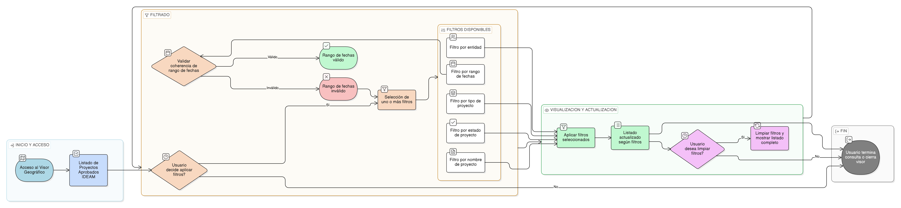

# HU-IDEAM-SNIF-REST-041

> **Identificador Historia de Usuario:** hu-ideam-snif-rest-041\
> **Nombre Historia de Usuario:** Filtrar proyectos en el listado previo a creación/edición

> **Sistema de información:** Sistema Nacional de Información Forestal\
> **Módulo / subsistema:** Módulo de restauración – Visor Geográfico\
> **Validador temático(s):** Raymond Alexander Jiménez Arteaga

## DESCRIPCIÓN HISTORIA DE USUARIO

> **Como:** usuario del Visor Geográfico.\
> **Quiero:** filtrar los proyectos de restauración en el listado.\
> **Para:** ubicar de forma rápida proyectos específicos según criterios definidos.

## ALCANCE FUNCIONAL

- Aplicación de filtros sobre el listado de proyectos del Visor Geográfico.
- Filtrado aplicado únicamente sobre proyectos **APROBADOS IDEAM**.
- Actualización del listado conforme a los criterios seleccionados.
- Persistencia temporal de los filtros durante la sesión del usuario.

## CRITERIOS DE ACEPTACIÓN

1. **Disponibilidad de filtros**\
   1.1 El sistema ofrece filtros para refinar el listado de proyectos del Visor Geográfico.\
   1.2 Los filtros se aplican únicamente sobre proyectos en estado **APROBADO IDEAM**.

2. **Filtros disponibles**\
   2.1 El sistema permite filtrar proyectos por los siguientes criterios:
   - Nombre del proyecto
   - Estado del proyecto  
   - Rango de fechas
   - Tipo de proyecto
   - Entidad

3. **Comportamiento del filtrado**\
   3.1 Al aplicar uno o más filtros, el listado se actualiza mostrando únicamente los proyectos que cumplen los criterios seleccionados.\
   3.2 Los filtros pueden combinarse entre sí.\
   3.3 El sistema permite limpiar los filtros y regresar al listado completo de proyectos aprobados.
   3.4 El filtro de fechas debe ser coherentes, al ser un rango, la fecha inicial debe ser igual o anterior a la fecha final.

4. **Integridad de la información**\
   4.1 El filtrado no modifica la información del proyecto.\
   4.2 El filtrado no altera el estado ni la visibilidad de los proyectos.

5. **Separación Gestión – Visor**\
   5.1 El filtrado disponible en el Visor no habilita acciones de gestión sobre los proyectos.\
   5.2 No se permite el acceso a funcionalidades de creación o edición desde el listado filtrado.

## ROLES

- **Usuario público / Invitado**: Aplica filtros para consultar proyectos aprobados.  
- **Registrador**: Aplica filtros para consulta desde el Visor Geográfico.  
- **Administrador IDEAM**: Aplica filtros para consulta desde el Visor Geográfico.

## RESTRICCIONES Y LÍMITES

- Los filtros se aplican únicamente a proyectos en estado APROBADO IDEAM.  
- El filtrado no requiere autenticación.  
- Esta historia de usuario no contempla filtros avanzados ni búsquedas textuales (definidas en otras HUs).  
- El filtrado no permite exportación de resultados.

## DIAGRAMA DE FLUJO DEL PROCESO

