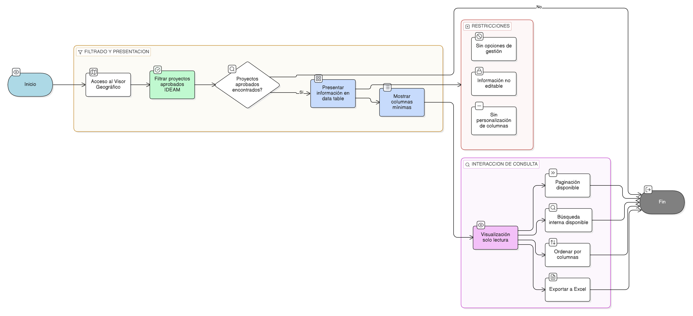

# HU-IDEAM-SNIF-REST-042

> **Identificador Historia de Usuario:** hu-ideam-snif-rest-042\
> **Nombre Historia de Usuario:** Visualizar proyectos en data table

> **Sistema de información:** Sistema Nacional de Información Forestal\
> **Módulo / subsistema:** Módulo de restauración – Visor Geográfico\
> **Validador temático(s):** Raymond Alexander Jiménez Arteaga

## DESCRIPCIÓN HISTORIA DE USUARIO

> **Como:** usuario del Visor Geográfico.\
> **Quiero:** visualizar los proyectos de restauración en un formato de data table.\
> **Para:** analizar y ejecutar acciones con la información general de los proyectos publicados.

## ALCANCE FUNCIONAL

- Visualización del listado de proyectos del Visor Geográfico en formato **data table**.
- Presentación estructurada de la información general del proyecto.
- Visualización únicamente de proyectos en estado **APROBADO IDEAM**.
- Interacción de solo lectura, sin capacidades de edición o gestión.

## CRITERIOS DE ACEPTACIÓN

1. **Formato del listado**\
   1.1 El sistema presenta el listado de proyectos del Visor Geográfico en formato data table.\
   1.2 El formato data table permite la visualización ordenada de múltiples proyectos.\

2. **Proyectos visibles**\
   2.1 La data table incluye únicamente proyectos en estado **APROBADO IDEAM**.\
   2.2 Los proyectos en otros estados no se visualizan en la data table del Visor.

3. **Columnas de la data table**\
   3.1 La data table presenta, como mínimo, las siguientes columnas:
   - Identificador del proyecto  
   - Nombre del proyecto  
   - Tipo de proyecto  
   - Entidad responsable  
   - Departamento  
   - Municipio  

4. **Integridad de la información**\
   4.1 La información mostrada en la data table corresponde a los datos validados del proyecto.\
   4.2 La visualización no permite modificar la información presentada.

5. **Separación Gestión – Visor**\
   5.1 La data table del Visor no presenta acciones de creación, edición, validación o desactivación.\
   5.2 No se permite acceder a funcionalidades de Gestión desde la data table.

6. **Funcionalidades de data table**\
   6.1 Debe permitir paginación\
   6.2 Debe tener opción de busqueda interna\
   6.3 Perimitir descarga de datos a formato plano de Excel\
   6.4 Ordenar la información por columnas

## ROLES

- **Usuario público / Invitado**: Puede acceder a la opción, y ver los proyectos validados por IDEAM desde el visor.  
- **Registrador**: Puede acceder a la opción, y ver los proyectos existentes en su entidad desde la aplicación de gestión, o todos los proyectos validados por IDEAM desde el visor.  
- **Administrador IDEAM**: Puede acceder a la opción, y ver los proyectos existentes desde la aplicación de gestión, o los proyectos ya validados por IDEAM desde el visor.

## RESTRICCIONES Y LÍMITES

- La data table es exclusivamente de consulta.  
- Solo se visualizan proyectos en estado APROBADO IDEAM.  
- La información mostrada no es editable.  
- Esta historia de usuario no contempla personalización de columnas.

## DIAGRAMA DE FLUJO DEL PROCESO

