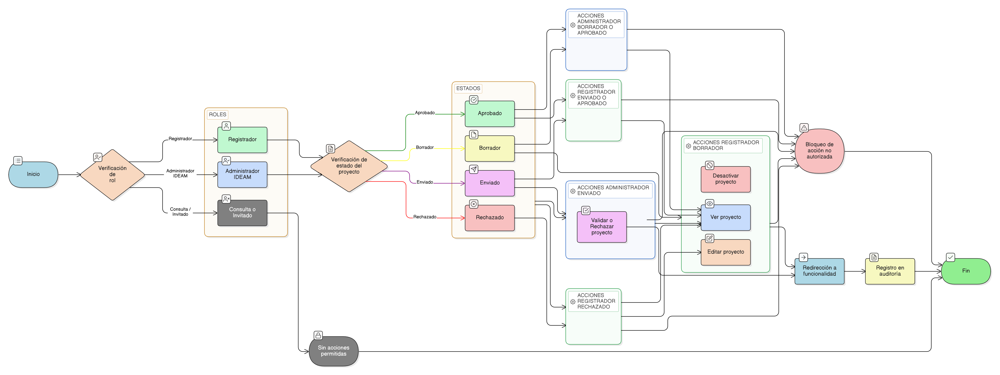

# HU-IDEAM-SNIF-REST-043

> **Identificador Historia de Usuario:** hu-ideam-snif-rest-043\
> **Nombre Historia de Usuario:** Ejecutar acciones sobre un proyecto desde el listado

> **Sistema de información:** Sistema Nacional de Información Forestal\
> **Módulo / subsistema:** Módulo de restauración – Aplicación de Gestión\
> **Validador temático(s):** Raymond Alexander Jiménez Arteaga

## DESCRIPCIÓN HISTORIA DE USUARIO

> **Como:** usuario con acceso a la aplicación de Gestión.\
> **Quiero:** ejecutar acciones sobre un proyecto directamente desde el listado.\
> **Para:** agilizar la gestión de los proyectos según mi rol y el estado del proyecto.

## ALCANCE FUNCIONAL

- Disponibilidad de acciones contextuales sobre cada proyecto desde el listado de Gestión.
- Habilitación o bloqueo de acciones según el rol del usuario y el estado del proyecto.
- Acceso directo a funcionalidades específicas sin ingresar previamente al detalle del proyecto.
- Protección contra la ejecución de acciones no permitidas.

## CRITERIOS DE ACEPTACIÓN

1. **Acceso a las acciones**\
   1.1 El sistema presenta acciones disponibles sobre cada proyecto desde el listado de la aplicación de Gestión.\
   1.2 Solo los usuarios con rol Registrador o Administrador IDEAM pueden visualizar acciones en el listado.\
   1.3 El rol Consulta / Invitado no visualiza acciones de gestión.

2. **Acciones disponibles para el rol Registrador**\
   2.1 Para proyectos en estado **BORRADOR**, el Registrador puede ejecutar las siguientes acciones:
   - Ver proyecto  
   - Editar proyecto  
   - Desactivar proyecto

   2.2 Para proyectos en estado **RECHAZADO**, el Registrador puede ejecutar las siguientes acciones:
   - Ver proyecto  
   - Editar proyecto  

   2.3 Para proyectos en estado **ENVIADO** o **APROBADO**, el Registrador solo puede ejecutar la acción:
   - Ver proyecto  

3. **Acciones disponibles para el rol Administrador IDEAM**\
   3.1 Para proyectos en estado **ENVIADO**, el Administrador IDEAM puede ejecutar las siguientes acciones:
   - Ver proyecto  
   - Validar / Rechazar proyecto  

   3.2 Para proyectos en estado **APROBADO**, el Administrador IDEAM solo puede ejecutar la acción:
   - Ver proyecto  

   3.3 Para proyectos en estado **BORRADOR**, el Administrador IDEAM solo puede ejecutar la acción:
   - Ver proyecto  

4. **Bloqueo de acciones no permitidas**\
   4.1 El sistema no muestra acciones que no estén permitidas por el rol y el estado del proyecto.\
   4.2 El sistema bloquea cualquier intento de ejecución de una acción no autorizada.

5. **Navegación desde el listado**\
   5.1 Al ejecutar una acción desde el listado, el sistema redirige a la funcionalidad correspondiente.\
   5.2 La ejecución de acciones no altera el contexto del listado al regresar.

6. **Auditoría**\
   6.1 El sistema registra en auditoría la ejecución de acciones relevantes sobre el proyecto desde el listado.

## ROLES

- **Registrador**: Ejecuta acciones sobre proyectos propios según su estado.  
- **Administrador IDEAM**: Ejecuta acciones de validación y consulta según el estado del proyecto.  
- **Consulta / Invitado**: No ejecuta acciones desde el listado.

## RESTRICCIONES Y LÍMITES

- Las acciones disponibles están estrictamente condicionadas por el rol y el estado del proyecto.  
- No se permite ejecutar acciones de edición, desactivación o validación desde el listado sin permisos.  
- Esta historia de usuario no contempla acciones masivas sobre múltiples proyectos.  
- La ejecución de acciones desde el listado no reemplaza las validaciones internas de cada funcionalidad.

## DIAGRAMA DE FLUJO DEL PROCESO

