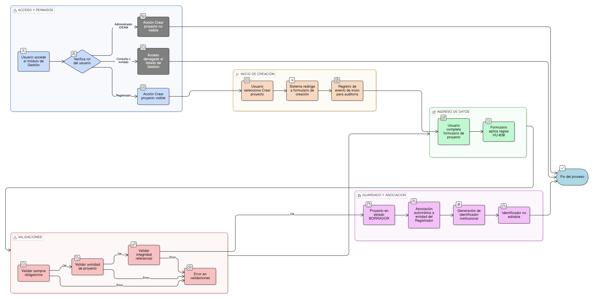

# HU-IDEAM-SNIF-REST-044

> **Identificador Historia de Usuario:** hu-ideam-snif-rest-044\
> **Nombre Historia de Usuario:** Crear un nuevo proyecto desde el listado

> **Sistema de información:** Sistema Nacional de Información Forestal\
> **Módulo / subsistema:** Módulo de restauración – Aplicación de Gestión\
> **Validador temático(s):** Raymond Alexander Jiménez Arteaga

## DESCRIPCIÓN HISTORIA DE USUARIO

> **Como:** Registrador.\
> **Quiero:** iniciar la creación de un nuevo proyecto de restauración desde el listado de proyectos.\
> **Para:** agilizar el registro de nuevas iniciativas sin abandonar el contexto de gestión.

## ALCANCE FUNCIONAL

- Habilitación de la opción para crear un nuevo proyecto desde el listado de proyectos de la aplicación de Gestión.
- Acceso directo al formulario de creación del proyecto.
- Aplicación de las mismas reglas de creación definidas en la HU-030.
- Asociación automática del proyecto a la entidad del Registrador.

## CRITERIOS DE ACEPTACIÓN

1. **Disponibilidad de la acción**\
   1.1 El sistema presenta la acción **Crear proyecto** en el listado de proyectos de la aplicación de Gestión.\
   1.2 Solo el rol Registrador puede visualizar y ejecutar la acción Crear proyecto.\
   1.3 El rol Administrador IDEAM no visualiza la acción Crear proyecto.\
   1.4 El rol Consulta / Invitado no tiene acceso al listado de Gestión.

2. **Inicio del flujo de creación**\
   2.1 Al ejecutar la acción Crear proyecto, el sistema redirige al formulario de creación de proyectos.\
   2.2 El formulario se presenta conforme a las reglas definidas en la [HU-IDEAM-SNIF-REST-030](HU-IDEAM-SNIF-REST-030.md)

3. **Estado inicial del proyecto**\
   3.1 El proyecto se crea inicialmente en estado **BORRADOR**.\
   3.2 El proyecto queda automáticamente asociado a la entidad del Registrador.

4. **Identificador del proyecto**\
   4.1 El identificador institucional del proyecto se genera al guardar el proyecto por primera vez.\
   4.2 El identificador no es editable.

5. **Validaciones y reglas aplicables**\
   5.1 El sistema aplica las validaciones de obligatoriedad, unicidad e integridad referencial definidas para la creación del proyecto.\
   5.2 El sistema aplica las reglas de unicidad definidas en la [HU-IDEAM-SNIF-REST-050](HU-IDEAM-SNIF-REST-050.md).

6. **Auditoría**\
   6.1 El sistema registra el evento de inicio de creación del proyecto para efectos de auditoría.

## ROLES

- **Registrador**: Inicia la creación de nuevos proyectos desde el listado de Gestión.  
- **Administrador IDEAM**: Consulta proyectos; no inicia creación.  
- **Consulta / Invitado**: No tiene acceso a la creación de proyectos.

## RESTRICCIONES Y LÍMITES

- La creación de proyectos desde el listado solo está disponible en la aplicación de Gestión.  
- No se permite crear proyectos desde el Visor Geográfico.  
- Esta historia de usuario no define nuevos campos ni reglas distintas a las de la HU-030.  
- La creación desde el listado no implica guardado automático del proyecto.

## DIAGRAMA DE FLUJO DEL PROCESO

