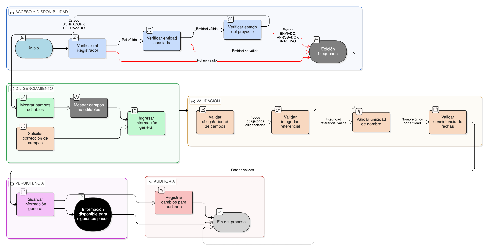

# HU-IDEAM-SNIF-REST-045

> **Identificador Historia de Usuario:** hu-ideam-snif-rest-045\
> **Nombre Historia de Usuario:** Completar información general del proyecto – Step Proyecto

> **Sistema de información:** Sistema Nacional de Información Forestal\
> **Módulo / subsistema:** Módulo de restauración – Aplicación de Gestión\
> **Validador temático(s):** Raymond Alexander Jiménez Arteaga

## DESCRIPCIÓN HISTORIA DE USUARIO

> **Como:** Registrador.\
> **Quiero:** completar la información general de un proyecto de restauración.\
> **Para:** registrar los datos básicos e identificadores del proyecto conforme a los lineamientos del IDEAM, estableciendo su marco administrativo y financiero.

## ALCANCE FUNCIONAL

- Diligenciamiento de la información general del proyecto como primer step del formulario.
- Asociación de la información general al proyecto en estado BORRADOR o RECHAZADO.
- Aplicación de validaciones de obligatoriedad, integridad referencial y unicidad.
- Persistencia de la información para habilitar los steps posteriores.

## CRITERIOS DE ACEPTACIÓN

1. **Acceso al step Información General**\
   1.1 Solo el rol Registrador puede diligenciar la información general del proyecto.\
   1.2 El Registrador solo puede diligenciar información de proyectos asociados a su entidad.\
   1.3 El step Información General solo está disponible para proyectos en estado **BORRADOR** o **RECHAZADO**.

2. **Campos del step Información General**\
   2.1 El sistema permite diligenciar como mínimo los siguientes campos:
   - Nombre del proyecto (obligatorio, único por entidad)
   - Tipo de proyecto (obligatorio)
   - Tipo de trámite (obligatorio)
   - Tipo de acto administrativo (obligatorio)
   - Fecha de actualización del plan de acción (obligatorio)
   - Número de acto administrativo (obligatorio)
   - Valor del proyecto en COP (obligatorio, máscara moneda)
   - Fecha de inicio (obligatorio)
   - Fecha de finalización (opcional)
   - Estado del proyecto (obligatorio)

3. **Campos no editables**\
   3.1 El sistema presenta como no editables los siguientes campos:
   - Identificador institucional del proyecto  
   - Estado del proyecto  

4. **Validaciones del dato**\
   4.1 El sistema valida la obligatoriedad de los campos definidos como obligatorios.\
   4.2 El sistema valida la integridad referencial con los catálogos definidos en la [EP-IDEAM-SNIF-REST-003](../EP-IDEAM-SNIF-REST-003.md).\
   4.3 El sistema aplica la regla de unicidad definida en la [HU-IDEAM-SNIF-REST-050](HU-IDEAM-SNIF-REST-050.md).
   4.4 Fecha de inicio tiene que ser igual o anterior a la fecha de finalización.
   4.5 Fecha del plan de acción debe ser igual o anterior a la fecha de inicio.

5. **Persistencia de la información**\
   5.1 El sistema permite guardar la información general del proyecto.\
   5.2 Al guardar correctamente la información, el sistema mantiene el proyecto en estado BORRADOR o RECHAZADO según corresponda.\
   5.3 La información guardada queda disponible para los steps posteriores del formulario.

6. **Restricciones por estado**\
   6.1 El sistema bloquea la edición de la información general cuando el proyecto se encuentra en estado **ENVIADO**, **APROBADO** o **INACTIVO**.

7. **Auditoría**\
   7.1 El sistema registra la actualización de la información general del proyecto para efectos de auditoría.

## ROLES

- **Registrador**: Diligencia y actualiza la información general del proyecto.  
- **Administrador IDEAM**: Consulta la información general durante el proceso de validación.  
- **Consulta / Invitado**: No tiene acceso al diligenciamiento de información del proyecto.

## RESTRICCIONES Y LÍMITES

- El diligenciamiento de la información general solo está disponible desde la aplicación de Gestión.  
- No se permite modificar la información general en proyectos ENVIADOS o APROBADOS.  
- Esta historia de usuario no contempla el envío del proyecto a validación.  
- Los cambios realizados están sujetos a auditoría.

## DIAGRAMA DE FLUJO DEL PROCESO

