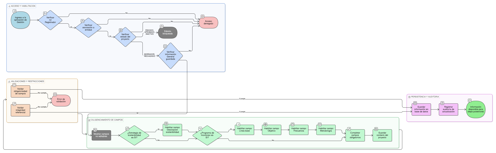

# HU-IDEAM-SNIF-REST-046

> **Identificador Historia de Usuario:** hu-ideam-snif-rest-046\
> **Nombre Historia de Usuario:** Completar contexto del proyecto – Step Proyecto

> **Sistema de información:** Sistema Nacional de Información Forestal\
> **Módulo / subsistema:** Módulo de restauración – Aplicación de Gestión\
> **Validador temático(s):** Raymond Alexander Jiménez Arteaga

## DESCRIPCIÓN HISTORIA DE USUARIO

> **Como:** Registrador.\
> **Quiero:** completar el contexto del proyecto de restauración.\
> **Para:** describir la sostenibilidad y monitoreo que caracteriza la iniciativa de restauración.

## ALCANCE FUNCIONAL

- Diligenciamiento del contexto del proyecto como step posterior a la Información General.
- Asociación del contexto al proyecto en estado BORRADOR o RECHAZADO.
- Aplicación de validaciones de obligatoriedad e integridad referencial.
- Persistencia de la información para habilitar los steps posteriores del formulario.

## CRITERIOS DE ACEPTACIÓN

1. **Acceso al step Contexto del Proyecto**\
   1.1 Solo el rol Registrador puede diligenciar el contexto del proyecto.\
   1.2 El Registrador solo puede diligenciar proyectos asociados a su entidad.\
   1.3 El step Contexto del Proyecto solo está disponible para proyectos en estado **BORRADOR** o **RECHAZADO**.\
   1.4 El step Contexto del Proyecto se habilita únicamente cuando la Información General ha sido guardada correctamente.

2. **Campos del step Contexto del Proyecto**\
   2.1 Si el proyecto tiene "Sí" en su atributo de "Estrategia de sostenibilidad", habilita los siguientes campos para ser completados:
   - Descripción
   2.2 Si el proyecto tiene "Sí" en su atributo de "Programa de monitoreo", habilita los siguientes campos para ser completados:
   - Línea base (obligatorio)
   - Objetivo (obligatorio)
   - Frecuencia (obligatorio)
   - Metodología (obligatorio)

3. **Campos no editables**\
   3.1 El sistema presenta como no editables los siguientes campos:
   - Identificador institucional del proyecto  
   - Estado del proyecto  
   - Entidad responsable  

4. **Validaciones del dato**\
   4.1 El sistema valida la integridad referencial con los catálogos definidos en la [EP-IDEAM-SNIF-REST-003](../EP-IDEAM-SNIF-REST-003.md).

5. **Persistencia de la información**\
   5.1 El sistema permite guardar la información de contexto del proyecto.\
   5.2 Al guardar correctamente la información, el sistema mantiene el proyecto en estado BORRADOR o RECHAZADO según corresponda.\
   5.3 La información guardada queda disponible para los steps posteriores del formulario.

6. **Restricciones por estado**\
   6.1 El sistema bloquea la edición del contexto del proyecto cuando el proyecto se encuentra en estado **ENVIADO**, **APROBADO** o **INACTIVO**.

7. **Auditoría**\
   7.1 El sistema registra la actualización de la información de contexto del proyecto para efectos de auditoría.

## ROLES

- **Registrador**: Diligencia y actualiza el contexto del proyecto.  
- **Administrador IDEAM**: Consulta el contexto del proyecto durante el proceso de validación.  
- **Consulta / Invitado**: No tiene acceso al diligenciamiento del contexto del proyecto.

## RESTRICCIONES Y LÍMITES

- El diligenciamiento del contexto del proyecto solo está disponible desde la aplicación de Gestión.  
- No se permite modificar el contexto del proyecto en proyectos ENVIADOS o APROBADOS.  
- Esta historia de usuario no contempla la definición de geometrías en el visor GIS.  
- Los cambios realizados están sujetos a auditoría.

## DIAGRAMA DE FLUJO DEL PROCESO

