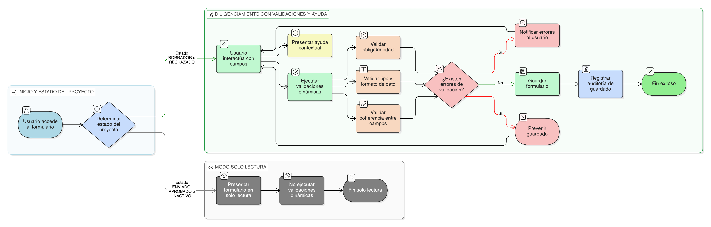

# HU-IDEAM-SNIF-REST-047

> **Identificador Historia de Usuario:** hu-ideam-snif-rest-047\
> **Nombre Historia de Usuario:** Validaciones dinámicas y ayuda contextual en el formulario

> **Sistema de información:** Sistema Nacional de Información Forestal\
> **Módulo / subsistema:** Módulo de restauración – Aplicación de Gestión\
> **Validador temático(s):** Raymond Alexander Jiménez Arteaga

## DESCRIPCIÓN HISTORIA DE USUARIO

> **Como:** usuario con acceso a la aplicación de Gestión.\
> **Quiero:** recibir validaciones dinámicas y ayuda contextual mientras diligencio el formulario del proyecto.\
> **Para:** reducir errores, mejorar la calidad del dato y facilitar el correcto diligenciamiento de la información.

## ALCANCE FUNCIONAL

- Ejecución de validaciones dinámicas en tiempo real durante el diligenciamiento del formulario.
- Presentación de ayudas contextuales asociadas a campos específicos.
- Aplicación transversal en los steps del formulario de proyecto.
- Prevención de guardado cuando existen errores de validación.

## CRITERIOS DE ACEPTACIÓN

1. **Validaciones dinámicas**\
   1.1 El sistema ejecuta validaciones dinámicas al interactuar con los campos del formulario.\
   1.2 Las validaciones se aplican sin necesidad de enviar o guardar el formulario.\
   1.3 El sistema identifica los campos que no cumplen con las reglas definidas.

2. **Reglas de validación aplicables**\
   2.1 El sistema valida la obligatoriedad de los campos definidos como obligatorios.\
   2.2 El sistema valida el formato y tipo de dato de los campos (numéricos, fechas, texto).\
   2.3 El sistema valida coherencias entre campos relacionados (por ejemplo, combinaciones permitidas).

3. **Ayuda contextual**\
   3.1 El sistema presenta mensajes de ayuda contextual asociados a campos específicos.\
   3.2 La ayuda contextual describe el propósito del campo y las reglas básicas de diligenciamiento.\
   3.3 La ayuda contextual no modifica la información del proyecto.

4. **Bloqueo por errores**\
   4.1 El sistema impide guardar el formulario cuando existen errores de validación.\
   4.2 El sistema informa al usuario sobre los campos que presentan errores.

5. **Aplicación por estado del proyecto**\
   5.1 Las validaciones dinámicas se aplican únicamente cuando el proyecto se encuentra en estado **BORRADOR** o **RECHAZADO**.\
   5.2 Cuando el proyecto se encuentra en estado **ENVIADO**, **APROBADO** o **INACTIVO**, el formulario se presenta en modo solo lectura y no ejecuta validaciones dinámicas.

6. **Persistencia y auditoría**\
   6.1 Las validaciones dinámicas no generan registros de auditoría por sí mismas.\
   6.2 El guardado exitoso posterior a validaciones sí queda registrado conforme a las reglas de auditoría del sistema.

## ROLES

- **Registrador**: Recibe validaciones dinámicas y ayuda contextual durante el diligenciamiento del formulario.  
- **Administrador IDEAM**: Visualiza la información sin ejecutar validaciones dinámicas.  
- **Consulta / Invitado**: No interactúa con el formulario en la aplicación de Gestión.

## RESTRICCIONES Y LÍMITES

- Las validaciones dinámicas no reemplazan las validaciones finales al guardar.  
- La ayuda contextual es informativa y no editable por el usuario.  
- Esta historia de usuario no contempla la configuración de reglas de validación por parte del usuario.  
- Las validaciones aplican únicamente en la aplicación de Gestión.

## DIAGRAMA DE FLUJO DEL PROCESO

